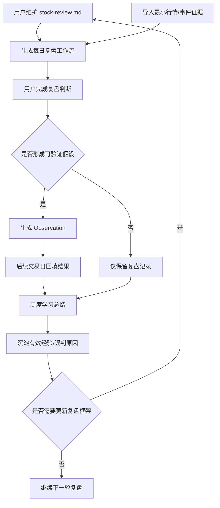

# 价值投机复盘助手 PRD

> 旧项目材料：本文档来自上一版失败项目，仅作为经验教训和背景参考，不作为当前项目定版需求。当前项目需求以 `docs/PRODUCT_REQUIREMENTS.md` 为准。

## 1. 背景与问题

当前项目在推进过程中暴露出一个核心问题：系统过早走向“全市场数据平台”和“候选池”，但用户真正需要的是围绕个人复盘框架进行每日复盘、验证判断、沉淀经验。

因此，新项目应重新收敛为一个“复盘与学习系统”：

- 帮助用户按 `stock-review.md` 的框架完成每日复盘。
- 补齐每个判断所需的最小证据。
- 把可验证判断沉淀为 Observation。
- 后续通过复盘结果更新经验，而不是让系统直接做股票推荐。

## 2. 产品定位

### 2.1 一句话定位

一个面向 A 股价值投机复盘的本地优先 CLI 工具，用于结构化记录市场判断、验证假设并沉淀可复用经验。

### 2.2 做什么

- 把用户复盘框架转换为每日可填写的复盘工作流。
- 为复盘步骤补充最小事实证据。
- 记录盘前/盘后/盘中形成的可验证假设。
- 在后续交易日回填验证结果。
- 周期性总结有效判断和反复误判。

### 2.3 不做什么

- 不做自动交易。
- 不做实时盯盘。
- 不做全市场行情平台。
- 不做普通资讯摘要工具。
- 不做纯机器选股候选池。
- 不用 LLM 替代事实证据和人工判断。
- MVP 不做 WebUI。

## 3. 用户与使用场景

### 3.1 目标用户

用户是有自己交易框架和复盘习惯的个人投资者，关注 A 股短线、题材轮动和价值投机机会。用户希望系统辅助自己复盘和学习，而不是替自己做买卖决策。

### 3.2 核心场景

| 场景 | 时间 | 用户目标 | 系统输出 |
| --- | --- | --- | --- |
| 盘后复盘 | 收盘后 | 判断市场阶段、风格、核心板块、核心票 | 每日复盘 Markdown |
| 盘前预案 | 开盘前 | 基于昨日复盘和新增信息形成验证计划 | 盘前 Observation 候选 |
| 盘中/午间检查 | 午间或盘中 | 检查是否符合预案 | 简短验证记录 |
| 次日/多日回看 | 后续交易日 | 判断 Observation 命中、失败或无效 | 回填结果 |
| 周度学习 | 周末 | 总结有效模式和误判模式 | 周度学习 Markdown |

## 4. 整体流程图



## 5. 数据原则

### 5.1 本地优先

MVP 优先使用本地轻量存储：

- Markdown：复盘输出、周度总结。
- YAML/JSON：配置、模板、规则。
- SQLite 或 DuckDB：结构化 Observation、行情摘要、验证结果。

除非明确需要同步或多设备访问，否则不优先引入云端数据库。

### 5.2 最小数据边界

MVP 只要求服务复盘的最小证据，不追求全市场覆盖：

- 指数表现：上证、深成指、创业板等关键指数。
- 总体量能：当日成交额、前一交易日成交额、近样本均值。
- 核心板块：用户关注或当日活跃板块。
- 核心票：用户复盘中提到的个股、板块中军、情绪锚点。
- 事件证据：公告、新闻或用户手工记录的催化。

## 6. 功能拆解

### F1. 复盘框架读取

**目标**：读取用户维护的 `stock-review.md`，识别复盘步骤并生成可填写工作流。

**输入**

- `stock-review.md`
- 交易日期

**输出**

- `YYYY-MM-DD_review.md`

**功能要求**

- 支持从 Markdown 标题中识别 `STEP N`。
- 保留用户原始步骤顺序。
- 当框架格式无法识别时，给出明确错误提示。

**可测试条件**

- 给定包含 3 个 STEP 的 Markdown，生成结果必须包含 3 个对应章节。
- 给定无 STEP 的 Markdown，CLI 必须提示框架不可识别。

**自动化测试**

- 单元测试：STEP 提取。
- CLI 测试：指定 `--skill-file` 后生成 Markdown。

### F2. 最小复盘证据导入

**目标**：为复盘提供足够但不过量的事实证据。

**输入**

- 日期
- 指数行情
- 用户关注股票列表
- 用户关注板块列表
- 手工事件或公告/新闻摘要

**输出**

- 本地结构化证据数据。
- 数据可用性报告。

**功能要求**

- 支持手工导入 CSV/JSON。
- 支持只导入关注池，不默认全市场。
- 能显示实际样本日期和证据缺口。

**可测试条件**

- 只有一天行情时，报告必须提示样本不足。
- 有多日行情时，报告必须显示样本日期范围。
- 缺指数、缺板块、缺事件时，必须分别提示。

**自动化测试**

- 单元测试：证据缺口识别。
- CLI 测试：导入样例文件后生成数据边界摘要。

### F3. 每日复盘工作流生成

**目标**：按复盘框架生成当天可填写的 Markdown。

**输入**

- 交易日期
- 复盘框架
- 最小证据数据

**输出**

- 每日复盘 Markdown。

**功能要求**

- 每个 STEP 包含“自动证据”和“待人工判断”。
- 自动证据不能得出超出数据支持的结论。
- 数据不足时必须显示缺口，而不是生成假结论。

**可测试条件**

- 缺少历史量能时，报告显示 `missing_previous_amount`。
- 缺少板块映射时，只在相关步骤显示缺口，不全篇重复。
- 有指数数据时，STEP 1 显示指数表现。

**自动化测试**

- 快照输入 -> Markdown 输出断言。
- 缺数据场景回归测试。

### F4. Observation 生成与维护

**目标**：把复盘中可验证的判断保存为 Observation。

**输入**

- 复盘日期
- 判断主题
- 相关板块/个股
- 假设
- 成立条件
- 失效条件
- 证据来源

**输出**

- Observation 记录。

**功能要求**

- Observation 必须包含假设、成立条件、失效条件。
- C 类弱催化或没有交易锚点的内容不能进入 Observation。
- 支持手工创建、编辑、作废。

**可测试条件**

- 缺少成立条件时，保存失败。
- 缺少失效条件时，保存失败。
- 重复 Observation 能被识别。

**自动化测试**

- 数据模型校验测试。
- CLI 创建/更新/作废测试。

### F5. Observation 回填

**目标**：在后续交易日回填判断结果，形成学习闭环。

**输入**

- Observation ID
- 实际结果
- 状态：命中、失败、无效、待观察
- 复盘备注

**输出**

- 更新后的 Observation。

**功能要求**

- 支持按日期列出待回填项。
- 支持记录命中/失败原因。
- 无效样本不得进入经验候选。

**可测试条件**

- pending 可以更新为 hit/miss/invalid。
- invalid 不进入周度经验候选。
- 重复回填不应生成重复记录。

**自动化测试**

- Repository 更新测试。
- 周度汇总过滤测试。

### F6. 周度学习总结

**目标**：把一周内的 Observation 结果整理成经验候选。

**输入**

- 起止日期
- 已回填 Observation

**输出**

- 周度学习 Markdown。

**功能要求**

- 区分命中样本、失败样本、无效样本。
- 总结有效判断模式。
- 总结误判原因。
- 只输出经验候选，不自动修改 `stock-review.md`。

**可测试条件**

- hit/miss 进入经验候选。
- invalid 只作为无效说明，不进入经验候选。
- 无回填数据时，明确提示样本不足。

**自动化测试**

- 周度汇总单元测试。
- Markdown 输出测试。

## 7. CLI 设计

MVP 只做 CLI。

### 7.1 命令草案

```powershell
.\.venv\Scripts\python -m app.main init
.\.venv\Scripts\python -m app.main import-evidence --date 2024-05-28 --file data/evidence/2024-05-28.yaml
.\.venv\Scripts\python -m app.main check-ready --date 2024-05-28
.\.venv\Scripts\python -m app.main review-workflow --date 2024-05-28 --framework stock-review.md
.\.venv\Scripts\python -m app.main observation add --date 2024-05-28
.\.venv\Scripts\python -m app.main observation update --id OBS_ID --status hit
.\.venv\Scripts\python -m app.main weekly-review --start-date 2024-05-27 --end-date 2024-05-31
```

### 7.2 CLI 验收标准

- 所有命令都有 `--help`。
- 失败时返回非 0 退出码。
- 失败提示要说明原因和下一步处理建议。
- 不输出密钥、数据库密码或 `.env` 原文。

## 8. 存储设计要求

MVP 推荐：

- `data/`：用户导入数据。
- `reports/`：生成的每日/周度 Markdown。
- `db.sqlite` 或 `review.duckdb`：结构化记录。

核心表或结构：

| 名称 | 用途 |
| --- | --- |
| `evidence_snapshots` | 每日最小事实证据 |
| `review_documents` | 每日复盘文档索引 |
| `observations` | 可验证假设 |
| `observation_reviews` | 回填结果 |

## 9. 验收标准

MVP 通过标准：

1. 可以在本地无云端数据库情况下完成初始化。
2. 可以用样例证据生成一份每日复盘 Markdown。
3. 报告能明确显示已使用样本日期和证据缺口。
4. 可以手工创建一条 Observation。
5. 可以回填 Observation 的命中/失败/无效状态。
6. 可以生成一份周度学习总结。
7. 全部核心流程有自动化测试或明确人工验证步骤。

## 10. 开发里程碑

### M1. 需求与流程固化

- 输出 PRD。
- 输出流程图。
- 输出功能点拆解。
- 输出测试计划。

验收：

- PRD 中每个功能点都有可测试条件。
- 用户确认范围没有跑偏。

### M2. 本地存储与样例数据

- 选择 SQLite 或 DuckDB。
- 定义最小数据结构。
- 准备离线样例数据。

验收：

- 无网络、无云端数据库时测试通过。

### M3. 复盘工作流生成

- 读取 `stock-review.md`。
- 生成每日复盘 Markdown。
- 显示最小证据和证据缺口。

验收：

- 样例数据生成报告。
- 缺数据场景不会产生误导性结论。

### M4. Observation 闭环

- 创建 Observation。
- 回填结果。
- 标记 invalid。

验收：

- Observation 可创建、更新、查询。
- invalid 不进入经验候选。

### M5. 周度学习总结

- 汇总 hit/miss/invalid。
- 输出经验候选。

验收：

- 能从样例 Observation 生成周度学习 Markdown。

## 11. 风险与控制

| 风险 | 控制方式 |
| --- | --- |
| 再次跑向全市场数据平台 | 每次新增采集前确认是否服务复盘步骤 |
| 数据不足却生成结论 | 报告必须显示证据缺口 |
| 过早引入 WebUI | CLI 稳定前不做 UI |
| 云端数据库增加复杂度 | MVP 默认本地轻量存储 |
| LLM 产生幻觉 | LLM 只能辅助整理，不能替代事实证据 |
| 复盘框架继续变化 | 框架读取必须动态识别 STEP，不硬编码步骤 |

## 12. 后续扩展

MVP 稳定后再考虑：

- WebUI。
- Notion 同步。
- LLM 辅助归纳周度经验。
- 半自动事件摘要。
- 多账户或多设备同步。
- 更完整的行情/板块数据源。

扩展前必须重新确认：是否服务“复盘与学习”，而不是把项目重新带回资讯平台或行情平台。
