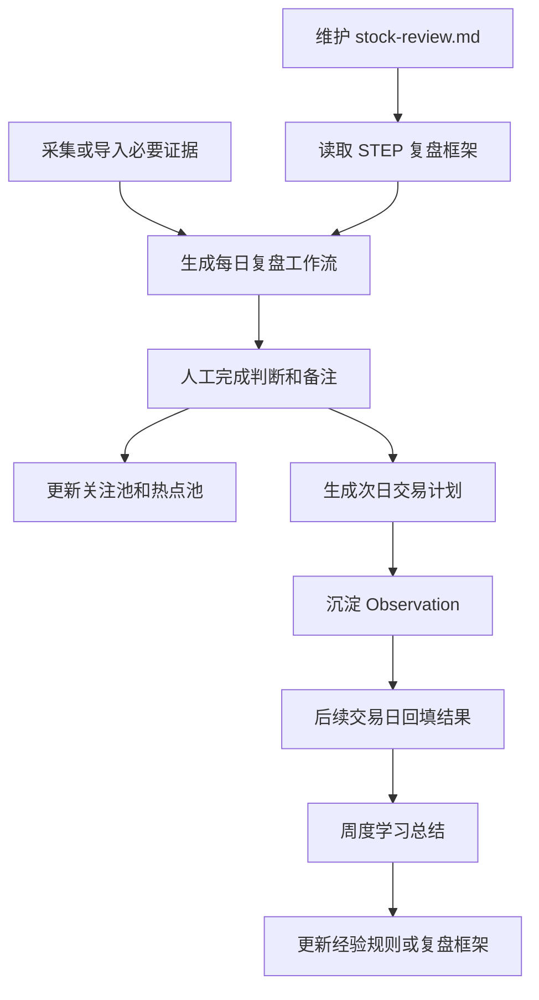

# 价值投机复盘助手

一个以 `stock-review.md` 为主流程、以有限股票池和必要行情/情绪数据为证据输入的 A 股短线盘后复盘与次日计划系统。

## 项目负责

- 读取用户维护的 `stock-review.md`，按 `STEP N` 顺序生成每日复盘工作流。
- 围绕复盘步骤补齐必要证据，包括市场环境、短线情绪、热点板块、核心个股和事件催化。
- 维护关注池、热点池、趋势强势池和潜在机会池，范围默认收敛在用户关注的 100-200 个股票内。
- 生成下一个交易日的观察计划，明确符合预期、超预期、不及预期和放弃条件。
- 把可验证判断沉淀为 Observation，并在后续交易日回填命中、失败、无效或待观察状态。
- 基于历史 Observation、热点池跟踪和交易计划回填生成周度学习总结。

## 项目不负责

- 不做自动交易。
- 不做实时盯盘系统。
- 不做全市场行情平台。
- 不做纯机器选股候选池。
- 不做普通资讯摘要工具。
- 不让 LLM 替代事实证据和人工判断。
- MVP 不做 WebUI。

## 核心流程



## 推荐技术栈

- 语言：Python 3.12 或 Python 3.13。
- CLI：M2 阶段使用 Python 标准库 `argparse`；后续命令复杂后再评估是否引入 Typer。
- 本地存储：SQLite。
- 数据模型校验：Pydantic。
- 配置和样例数据：YAML/JSON。
- 报告输出：Markdown。
- 测试：M2 阶段使用 Python 标准库 `unittest`；后续依赖安装稳定后再评估是否引入 pytest。
- 后续 LLM：OpenAI-compatible client，只用于基于证据的归纳和总结。

## 当前状态

- M1 文档已定版：当前需求以 `docs/PRODUCT_REQUIREMENTS.md` 为准，根目录 `PRD.md` 仅作为上一版经验参考。
- M2 已完成最小闭环：可以读取 `stock-review.md`，动态识别 `# STEP N: 标题`，并生成每日复盘 Markdown。
- M3 已完成最小离线闭环：可以导入本地 JSON 样例证据，生成 Evidence Snapshot，识别关键证据缺口，并写入本地 SQLite。
- M3.5 已完成最小接入：`review create` 可通过 `--evidence` 读取 Evidence Snapshot，并在日报中按 STEP 展示对应事实证据和风险缺口。
- M4.1 已完成最小池子管理：可以手工加入和查看关注池、热点池，同一池子内重复股票会报明确错误。
- M4.2 已完成最小次日计划：可以基于日报、Evidence Snapshot 和池子记录生成次日观察计划 Markdown。
- M4.5 已完成 AKShare 市场层最小接入口：提供 `evidence collect --source akshare --scope market`，用于采集指数和成交额 Evidence Snapshot；真实采集需先安装可选依赖。
- M4.6 已完成短线情绪和板块真实证据最小接入口：提供 `evidence collect --source akshare --scope sentiment|sectors`，用于采集涨停数、跌停数、炸板率、连板高度和热门板块事实。
- M4.7 已完成个股事实证据最小接入口：提供 `evidence collect --source akshare --scope stocks`，只提取已有板块领涨股和涨停池连板股事实，不认定核心票。
- M5 已完成 Observation 最小闭环：支持手工创建、按日期/状态查询，以及回填 `pending|hit|miss|invalid`。
- M6.1 已完成周度学习总结最小闭环：按日期范围汇总 Observation，区分命中、失败、无效和待观察样本，并输出可追溯经验候选。
- M6.2.1 已完成市场状态与板块强度可解释评分：固定规则输出得分、标签、证据覆盖率和字段缺口。
- M6.2.2 已完成个股角色标签与买点模式疑似匹配：只基于 Evidence Snapshot 已有个股事实生成候选标签和疑似观察模式，并展示证据缺口。
- M7.1 已完成 AKShare 采集稳定性最小闭环：同交易日同 scope 默认复用已有有效快照；重新联网需显式传入 `--refresh`；同次采集请求固定节流并标记失败类别，已完成 market scope 真实验证。
- M7.2 已完成候选短线情绪数据源可用性评估：当前没有可新增接入的数据源，继续保留 `missing_emotion_temperature` 和手工补录兜底。
- M8 已完成单日复盘闭环验收：`2026-07-10` 的日报、计划、Observation 回填和周度学习总结已按同一证据来源回查；缺口保持待确认，验收样例标记为 `invalid`，不进入经验候选。
- M9 已完成阶段性基线收口：已区分验证样例与真实业务数据，并补充本地离线验证、备份、恢复和清理边界。
- M10.1 已完成首个板块历史子闭环：可从本地快照输出每日最强板块事实、缺口日期和近期反复活跃候选；少于 5 个有效板块交易日时不认定核心板块。
- M10.1 已完成市场历史事实子闭环：可从本地快照输出每日指数、成交额和区间涨跌事实；少于 5 个有效市场交易日时不判断市场阶段。
- M10.1 已完成池子生命周期子闭环：可显式暂停、移出或重新启用池子对象，并保留每次状态变更原因与历史。
- M10.1 已完成单日多 scope 采集子闭环：用户显式指定 scope 后可顺序采集市场、情绪、板块和个股；部分失败不会覆盖已有事实，并按非零状态和日志提示。
- M10.1 已接入 hhxg 最近交易日快照：自动补充涨跌停、炸板、连板梯队与板块排行；返回日期必须等于指定日期，连续采集满 5 个交易日后才启用其历史分析。
- 后续计划：M10 按 10 个 STEP 补齐时序证据、事实归纳、结构化人工复盘、模式核验、真实样本学习和框架版本演进。具体边界见 `docs/PRODUCT_REQUIREMENTS.md`。
- 当前 `stock-review.md` 实际包含 `STEP 1` 到 `STEP 10`，命令会按文件内容动态识别，不硬编码 STEP 数量。
- 当前已在本地开发环境完成 2026-07-06 的真实联网采集验证；MVP 暂不建设 WebUI。
- 个股角色标签和买点模式疑似匹配只基于数据源明确给出的板块领涨、连板等事实，不能认定核心票、龙头或确认买点。
- 当前日报只展示 Evidence Snapshot 中已有字段，禁止生成没有证据支持的市场、板块或个股结论。
- 当前计划只记录观察条件和应对框架，不是买卖指令。
- 当前已在本地开发环境完成 2026-07-06 的 M4.7 真实联网个股采集，快照只剩 `missing_emotion_temperature`。

## 最小启动

当前仓库已创建最小源码包。未安装 editable 包时，可在 PowerShell 中临时设置 `PYTHONPATH` 后运行：

本地直接运行：

```powershell
$env:PYTHONPATH='src'
$env:PYTHONDONTWRITEBYTECODE='1'
python -m stock_review.cli framework check --file stock-review.md
python -m stock_review.cli review create --date 2026-07-06 --framework stock-review.md
python -m stock_review.cli review create --date 2026-07-06 --framework stock-review.md --evidence data/evidence/2026-07-06_snapshot.json
python -m stock_review.cli evidence import --date 2026-07-06 --file data/evidence/2026-07-06_sample.json
python -m stock_review.cli evidence check --date 2026-07-06
python -m stock_review.cli evidence sector-history --start 2026-07-06 --end 2026-07-10 --snapshot-dir data/evidence --output-dir reports/daily
python -m stock_review.cli evidence market-history --start 2026-07-06 --end 2026-07-10 --snapshot-dir data/evidence --output-dir reports/daily
python -m stock_review.cli evidence collect-hhxg --date 2026-07-10 --output-dir data/evidence
python -m stock_review.cli evidence collect-pool-history --date 2026-07-10 --source akshare --output-dir data/evidence
python -m stock_review.cli evidence history-readiness --source hhxg --start 2026-07-06 --end 2026-07-10 --snapshot-dir data/evidence
python -m stock_review.cli pool add-watch --code 000001 --name 平安银行 --date 2026-07-06 --reason 样例关注 --exchange SZSE --sector 银行
python -m stock_review.cli pool add-hot --code 600519 --name 贵州茅台 --date 2026-07-06 --reason 样例热点 --exchange SSE --sector 白酒
python -m stock_review.cli pool list
python -m stock_review.cli pool list --record-kind real
python -m stock_review.cli pool update-record-kind --type hot --code 600519 --record-kind sample --reason 系统验收样例
python -m stock_review.cli pool candidates --date 2026-07-10 --snapshot-dir data/evidence
python -m stock_review.cli pool update-status --type watch --code 000001 --status paused --reason 等待板块确认
python -m stock_review.cli pool history --type watch --code 000001
python -m stock_review.cli plan create --date 2026-07-06 --review reports/daily/2026-07-06_review.md --evidence data/evidence/2026-07-06_snapshot.json
python -m stock_review.cli evidence collect --date 2026-07-06 --source akshare --scope market --output-dir data/evidence
python -m stock_review.cli evidence collect --date 2026-07-06 --source akshare --scope sentiment --output-dir data/evidence
python -m stock_review.cli evidence collect --date 2026-07-06 --source akshare --scope sectors --output-dir data/evidence
python -m stock_review.cli evidence collect --date 2026-07-06 --source akshare --scope stocks --output-dir data/evidence
python -m stock_review.cli evidence collect-daily --date 2026-07-06 --source akshare --scope market --scope sentiment --scope sectors --scope stocks --output-dir data/evidence
python -m stock_review.cli evidence collect --date 2026-07-06 --source akshare --scope sentiment --output-dir data/evidence --refresh
python -m stock_review.cli observation add --date 2026-07-06 --topic 机器人板块延续性 --target 机器人板块 --hypothesis 机器人板块次日保持强势 --confirmation 板块次日继续放量 --invalidation "板块跌幅超过 2%" --evidence-source "2026-07-06 Evidence Snapshot"
python -m stock_review.cli observation list --date 2026-07-06 --status pending
python -m stock_review.cli observation review --id OBS-20260706-001 --status hit --result "板块次日上涨 3%" --note 成立条件满足
python -m stock_review.cli learning weekly --start 2026-07-06 --end 2026-07-10
python -m stock_review.cli scoring create --date 2026-07-06 --evidence data/evidence/2026-07-06_snapshot.json
```

可选初始化：

```powershell
python -m venv .venv
.\.venv\Scripts\python.exe -m pip install -e .[dev]
```

当前已实现 CLI：

```powershell
.\.venv\Scripts\python.exe -m stock_review.cli framework check --file stock-review.md
.\.venv\Scripts\python.exe -m stock_review.cli review create --date 2026-07-06 --framework stock-review.md
.\.venv\Scripts\python.exe -m stock_review.cli review create --date 2026-07-06 --framework stock-review.md --evidence data/evidence/2026-07-06_snapshot.json
.\.venv\Scripts\python.exe -m stock_review.cli evidence import --date 2026-07-06 --file data/evidence/2026-07-06_sample.json
.\.venv\Scripts\python.exe -m stock_review.cli evidence check --date 2026-07-06
.\.venv\Scripts\python.exe -m stock_review.cli evidence sector-history --start 2026-07-06 --end 2026-07-10 --snapshot-dir data/evidence --output-dir reports/daily
.\.venv\Scripts\python.exe -m stock_review.cli evidence market-history --start 2026-07-06 --end 2026-07-10 --snapshot-dir data/evidence --output-dir reports/daily
.\.venv\Scripts\python.exe -m stock_review.cli pool add-watch --code 000001 --name 平安银行 --date 2026-07-06 --reason 样例关注 --exchange SZSE --sector 银行
.\.venv\Scripts\python.exe -m stock_review.cli pool add-hot --code 600519 --name 贵州茅台 --date 2026-07-06 --reason 样例热点 --exchange SSE --sector 白酒
.\.venv\Scripts\python.exe -m stock_review.cli pool list
.\.venv\Scripts\python.exe -m stock_review.cli pool list --record-kind real
.\.venv\Scripts\python.exe -m stock_review.cli pool update-record-kind --type hot --code 600519 --record-kind sample --reason 系统验收样例
.\.venv\Scripts\python.exe -m stock_review.cli pool candidates --date 2026-07-10 --snapshot-dir data/evidence
.\.venv\Scripts\python.exe -m stock_review.cli pool update-status --type watch --code 000001 --status paused --reason 等待板块确认
.\.venv\Scripts\python.exe -m stock_review.cli pool history --type watch --code 000001
.\.venv\Scripts\python.exe -m stock_review.cli plan create --date 2026-07-06 --review reports/daily/2026-07-06_review.md --evidence data/evidence/2026-07-06_snapshot.json
.\.venv\Scripts\python.exe -m stock_review.cli evidence collect --date 2026-07-06 --source akshare --scope market --output-dir data/evidence
.\.venv\Scripts\python.exe -m stock_review.cli evidence collect --date 2026-07-06 --source akshare --scope sentiment --output-dir data/evidence
.\.venv\Scripts\python.exe -m stock_review.cli evidence collect --date 2026-07-06 --source akshare --scope sectors --output-dir data/evidence
.\.venv\Scripts\python.exe -m stock_review.cli evidence collect --date 2026-07-06 --source akshare --scope stocks --output-dir data/evidence
.\.venv\Scripts\python.exe -m stock_review.cli evidence collect-daily --date 2026-07-06 --source akshare --scope market --scope sentiment --scope sectors --scope stocks --output-dir data/evidence
.\.venv\Scripts\python.exe -m stock_review.cli evidence collect-pool-history --date 2026-07-10 --source akshare --output-dir data/evidence
.\.venv\Scripts\python.exe -m stock_review.cli evidence history-readiness --source hhxg --start 2026-07-06 --end 2026-07-10 --snapshot-dir data/evidence
.\.venv\Scripts\python.exe -m stock_review.cli evidence collect --date 2026-07-06 --source akshare --scope sentiment --output-dir data/evidence --refresh
.\.venv\Scripts\python.exe -m stock_review.cli observation add --date 2026-07-06 --topic 机器人板块延续性 --target 机器人板块 --hypothesis 机器人板块次日保持强势 --confirmation 板块次日继续放量 --invalidation "板块跌幅超过 2%" --evidence-source "2026-07-06 Evidence Snapshot"
.\.venv\Scripts\python.exe -m stock_review.cli observation list --date 2026-07-06 --status pending
.\.venv\Scripts\python.exe -m stock_review.cli observation review --id OBS-20260706-001 --status hit --result "板块次日上涨 3%" --note 成立条件满足
.\.venv\Scripts\python.exe -m stock_review.cli learning weekly --start 2026-07-06 --end 2026-07-10
.\.venv\Scripts\python.exe -m stock_review.cli scoring create --date 2026-07-06 --evidence data/evidence/2026-07-06_snapshot.json
```

测试：

```powershell
$env:PYTHONPATH='src'
$env:PYTHONDONTWRITEBYTECODE='1'
python -m unittest discover -s tests
```

## 目录说明

- `AGENTS.md`：AI 协作约束、任务分级、工程风格、项目架构红线和证据收口。
- `README.md`：项目入口说明、核心流程、技术栈和启动口径。
- `docs/PRODUCT_REQUIREMENTS.md`：当前项目需求、功能拆解、数据边界、MVP 里程碑和风险控制。
- `docs/LOCAL_DATA_OPERATIONS.md`：本地数据分类、离线验证、备份、恢复和清理边界。
- `PRD.md`：上一版失败项目材料，仅作为经验教训和背景参考，不作为当前定版需求。
- `stock-review.md`：用户维护的盘后复盘框架，是系统主流程来源。
- `src/stock_review/`：主工程源码，当前包含 CLI、复盘框架解析、带证据日报生成、次日计划生成、周度学习总结、Markdown 渲染、Evidence Snapshot、AKShare source、池子管理、Observation 管理和 SQLite repository。
- `tests/`：自动化测试目录，当前覆盖 STEP 识别、日报生成、证据接入、AKShare 标准化、SQLite 保存、池子管理、计划生成、Observation 闭环和周度学习总结。
- `data/`：本地样例数据、证据快照、池子记录和本地 SQLite，当前 `data/evidence/` 保存离线样例和标准化快照。
- `reports/`：Markdown 输出目录，`reports/daily/` 用于日报和计划，`reports/weekly/` 用于周度学习总结。
- `logs/`：正式 CLI 写操作日志，当前记录日报生成命令、日期、框架、输出文件和状态。

## 文档索引

- `stock-review.md`：复盘步骤和交易约束。
- `docs/PRODUCT_REQUIREMENTS.md`：当前定版需求。
- `PRD.md`：旧项目材料和失败经验来源。
- `AGENTS.md`：协作和工程红线。

## AI 协作口径

- 本项目默认按“小步闭环”协作：每次只完成用户当前要求的最小可验证目标。
- `stock-review.md` 是复盘流程事实来源；除非用户明确要求，不修改其中交易框架内容。
- 数据源服务复盘步骤，禁止为了数据完整性扩展成全市场平台。
- 用户说“继续下一步”时，表示当前任务应收口并切换到下一项；除非当前任务尚未达到完成标准。
- 旁支问题默认只记录为后续建议，不在当前任务中展开。
- 需要扩大范围、重构、兼容旧逻辑、批量清理、真实联调或接入真实数据源时，必须先征得用户确认。

## 环境口径

- 开发环境：本地 Windows + PowerShell + Python 虚拟环境。
- 测试环境：暂未设置。
- 生产环境：暂未设置。
- 本地验证默认只使用样例数据、只读数据源或用户明确授权的开发环境配置。
- 涉及真实行情接口、第三方数据源、数据库写入、远端服务或自动化采集前，必须先说明环境、对象、影响范围和验证证据。

## 数据源口径

- 首选真实数据源：AKShare，用于先补市场、短线情绪和板块层事实证据。
- 当前 AKShare `market` 最小范围：上证指数、深证成指、创业板指日线；成交额来自数据源返回的指数日线成交额求和，并在快照中标记来源。AKShare/东方财富失败时，会尝试腾讯指数 K 线备用路径。
- 当前 AKShare `sentiment` 最小范围：东方财富涨停池、炸板池、跌停池，生成涨停数、跌停数、炸板率和连板高度。情绪温度暂无稳定真实来源，单独标记 `missing_emotion_temperature`。
- 当前 AKShare `sectors` 最小范围：东方财富概念/行业板块列表；在当前网络不可用时，兜底使用同花顺行业汇总，生成板块涨跌幅、成交额、上涨/下跌家数和领涨股。当前不写入核心票列表。
- 当前 AKShare `stocks` 最小范围：从快照已有板块领涨股和东方财富涨停池连板股提取事实；缺少代码、交易所或板块时标记待确认，不认定核心票、不修改池子。
- 分 scope 采集会合并到同一交易日 Evidence Snapshot，后采集的空字段不会覆盖已有 market、sentiment 或 sectors 证据。
- 新采集快照会分别记录 market、sentiment、sectors 和 stocks 的字段来源；旧快照未记录字段来源时，报告会标记待确认，不从顶层来源反推。
- 同交易日同 scope 已有有效 AKShare 事实时默认复用快照，避免重复请求；只有显式 `--refresh` 才重新联网采集。
- 同次 AKShare scope 采集的连续请求固定间隔 0.3 秒；失败按 `rate_limited`、`network_timeout`、`access_denied` 或 `upstream_unavailable` 标记，不据此断言 IP 被封禁。
- 可选依赖安装：`python -m pip install -e .[data]`。
- 备选数据源：
  - 开盘啦或同类短线情绪源：后续补涨停原因、连板梯队、题材强度和情绪温度。
  - Tushare：后续补更稳定的结构化历史行情和专业数据。
  - Baostock：后续可作为历史行情兜底，不作为短线情绪首选。

## 当前证据缺口

以 2026-07-06 真实采集快照为例，当前已补齐 `market`、短线情绪核心字段、`sectors` 和 `stocks`，仍保留：

- `missing_emotion_temperature`：情绪温度暂无稳定真实来源，后续可评估开盘啦或同类短线情绪源。

## 每日 hhxg 手动积累

收盘后仅在确认当日为交易日时手工执行。将 `$tradeDate` 改为当天实际交易日期；hhxg 返回日期不一致时命令会失败且不会写入历史日期。当前从 `2026-07-10` 开始积累，满 5 个有效交易日后才可启用对应历史分析。

```powershell
$env:PYTHONPATH='src'
$env:PYTHONDONTWRITEBYTECODE='1'
$tradeDate='YYYY-MM-DD'
.\.venv\Scripts\python.exe -m stock_review.cli evidence collect-hhxg --date $tradeDate --output-dir data/evidence
.\.venv\Scripts\python.exe -m stock_review.cli evidence history-readiness --source hhxg --start 2026-07-10 --end $tradeDate --snapshot-dir data/evidence
.\.venv\Scripts\python.exe -m stock_review.cli evidence hhxg-history --start 2026-07-10 --end $tradeDate --snapshot-dir data/evidence --output-dir reports/daily
```

`history-readiness` 只读取本地快照，不会触发联网、写入 SQLite 或自动补采；`hhxg-history` 会生成本地 Markdown 报告。少于 5 个有效交易日时会明确提示不得输出历史分析结论。

## 今日验证命令

2026-07-08 已在本地开发环境验证：

```powershell
$env:PYTHONPATH='src'
$env:PYTHONDONTWRITEBYTECODE='1'
.\.venv\Scripts\python.exe -m unittest discover -s tests
.\.venv\Scripts\python.exe -m stock_review.cli evidence collect --date 2026-07-06 --source akshare --scope market --output-dir data/evidence
.\.venv\Scripts\python.exe -m stock_review.cli evidence collect --date 2026-07-06 --source akshare --scope sentiment --output-dir data/evidence
.\.venv\Scripts\python.exe -m stock_review.cli evidence collect --date 2026-07-06 --source akshare --scope sectors --output-dir data/evidence
.\.venv\Scripts\python.exe -m stock_review.cli review create --date 2026-07-06 --framework stock-review.md --evidence data/evidence/2026-07-06_snapshot.json
```
