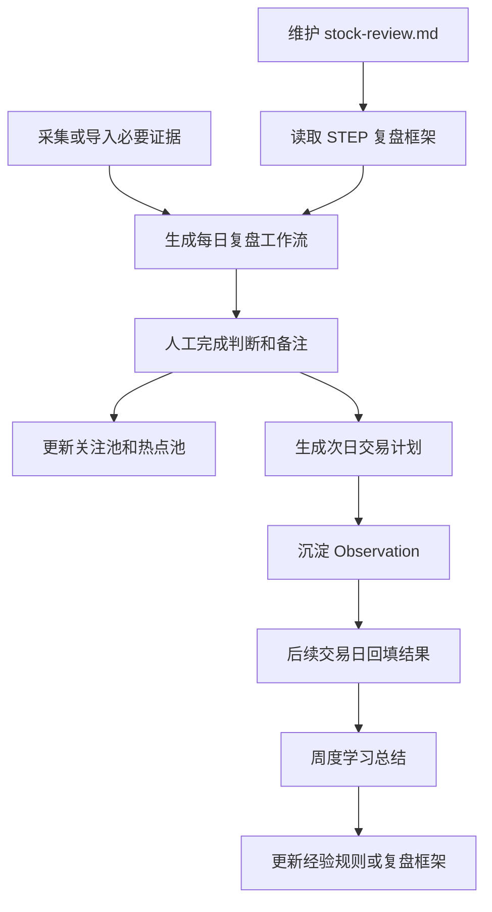

# 价值投机复盘助手

一个以 `stock-review.md` 为主流程、以有限股票池和必要行情/情绪数据为证据输入的 A 股短线盘后复盘与次日计划系统。

## 项目负责

- 读取用户维护的 `stock-review.md`，按 `STEP N` 顺序生成每日复盘工作流。
- 围绕复盘步骤补齐必要证据，包括市场环境、短线情绪、热点板块、核心个股和事件催化。
- 维护关注池、热点池、趋势强势池和潜在机会池，范围默认收敛在用户关注的 100-200 个股票内。
- 生成下一个交易日的观察计划，明确符合预期、超预期、不及预期和放弃条件。
- 把可验证判断沉淀为 Observation，并在后续交易日回填命中、失败、无效或待观察状态。
- 基于历史 Observation、热点池跟踪和交易计划回填生成周度学习总结。

## 项目不负责

- 不做自动交易。
- 不做实时盯盘系统。
- 不做全市场行情平台。
- 不做纯机器选股候选池。
- 不做普通资讯摘要工具。
- 不让 LLM 替代事实证据和人工判断。
- MVP 不做 WebUI。

## 核心流程



## 推荐技术栈

- 语言：Python 3.12 或 Python 3.13。
- CLI：M2 阶段使用 Python 标准库 `argparse`；后续命令复杂后再评估是否引入 Typer。
- 本地存储：SQLite。
- 数据模型校验：Pydantic。
- 配置和样例数据：YAML/JSON。
- 报告输出：Markdown。
- 测试：M2 阶段使用 Python 标准库 `unittest`；后续依赖安装稳定后再评估是否引入 pytest。
- 后续 LLM：OpenAI-compatible client，只用于基于证据的归纳和总结。

## 当前状态

- M1 文档已定版：当前需求以 `docs/PRODUCT_REQUIREMENTS.md` 为准，根目录 `PRD.md` 仅作为上一版经验参考。
- M2 已完成最小闭环：可以读取 `stock-review.md`，动态识别 `# STEP N: 标题`，并生成每日复盘 Markdown。
- M3 已完成最小离线闭环：可以导入本地 JSON 样例证据，生成 Evidence Snapshot，识别关键证据缺口，并写入本地 SQLite。
- M3.5 已完成最小接入：`review create` 可通过 `--evidence` 读取 Evidence Snapshot，并在日报中按 STEP 展示对应事实证据和风险缺口。
- M4.1 已完成最小池子管理：可以手工加入和查看关注池、热点池，同一池子内重复股票会报明确错误。
- M4.2 已完成最小次日计划：可以基于日报、Evidence Snapshot 和池子记录生成次日观察计划 Markdown。
- M4.5 已完成 AKShare 市场层最小接入口：提供 `evidence collect --source akshare --scope market`，用于采集指数和成交额 Evidence Snapshot；真实采集需先安装可选依赖。
- M4.6 已完成短线情绪和板块真实证据最小接入口：提供 `evidence collect --source akshare --scope sentiment|sectors`，用于采集涨停数、跌停数、炸板率、连板高度和热门板块事实。
- 当前 `stock-review.md` 实际包含 `STEP 1` 到 `STEP 10`，命令会按文件内容动态识别，不硬编码 STEP 数量。
- 当前已在本地开发环境完成 2026-07-06 的真实联网采集验证，尚未接入 Observation 或 WebUI。
- 当前日报只展示 Evidence Snapshot 中已有字段，禁止生成没有证据支持的市场、板块或个股结论。
- 当前计划只记录观察条件和应对框架，不是买卖指令。
- 当前仍未接入真实个股核心票证据；`missing_stocks` 需要后续从板块领涨股、涨停池连板股或用户池子中补齐。

## 最小启动

当前仓库已创建最小源码包。未安装 editable 包时，可在 PowerShell 中临时设置 `PYTHONPATH` 后运行：

本地直接运行：

```powershell
$env:PYTHONPATH='src'
$env:PYTHONDONTWRITEBYTECODE='1'
python -m stock_review.cli framework check --file stock-review.md
python -m stock_review.cli review create --date 2026-07-06 --framework stock-review.md
python -m stock_review.cli review create --date 2026-07-06 --framework stock-review.md --evidence data/evidence/2026-07-06_snapshot.json
python -m stock_review.cli evidence import --date 2026-07-06 --file data/evidence/2026-07-06_sample.json
python -m stock_review.cli evidence check --date 2026-07-06
python -m stock_review.cli pool add-watch --code 000001 --name 平安银行 --date 2026-07-06 --reason 样例关注 --exchange SZSE --sector 银行
python -m stock_review.cli pool add-hot --code 600519 --name 贵州茅台 --date 2026-07-06 --reason 样例热点 --exchange SSE --sector 白酒
python -m stock_review.cli pool list
python -m stock_review.cli plan create --date 2026-07-06 --review reports/daily/2026-07-06_review.md --evidence data/evidence/2026-07-06_snapshot.json
python -m stock_review.cli evidence collect --date 2026-07-06 --source akshare --scope market --output-dir data/evidence
python -m stock_review.cli evidence collect --date 2026-07-06 --source akshare --scope sentiment --output-dir data/evidence
python -m stock_review.cli evidence collect --date 2026-07-06 --source akshare --scope sectors --output-dir data/evidence
```

可选初始化：

```powershell
python -m venv .venv
.\.venv\Scripts\python.exe -m pip install -e .[dev]
```

当前已实现 CLI：

```powershell
.\.venv\Scripts\python.exe -m stock_review.cli framework check --file stock-review.md
.\.venv\Scripts\python.exe -m stock_review.cli review create --date 2026-07-06 --framework stock-review.md
.\.venv\Scripts\python.exe -m stock_review.cli review create --date 2026-07-06 --framework stock-review.md --evidence data/evidence/2026-07-06_snapshot.json
.\.venv\Scripts\python.exe -m stock_review.cli evidence import --date 2026-07-06 --file data/evidence/2026-07-06_sample.json
.\.venv\Scripts\python.exe -m stock_review.cli evidence check --date 2026-07-06
.\.venv\Scripts\python.exe -m stock_review.cli pool add-watch --code 000001 --name 平安银行 --date 2026-07-06 --reason 样例关注 --exchange SZSE --sector 银行
.\.venv\Scripts\python.exe -m stock_review.cli pool add-hot --code 600519 --name 贵州茅台 --date 2026-07-06 --reason 样例热点 --exchange SSE --sector 白酒
.\.venv\Scripts\python.exe -m stock_review.cli pool list
.\.venv\Scripts\python.exe -m stock_review.cli plan create --date 2026-07-06 --review reports/daily/2026-07-06_review.md --evidence data/evidence/2026-07-06_snapshot.json
.\.venv\Scripts\python.exe -m stock_review.cli evidence collect --date 2026-07-06 --source akshare --scope market --output-dir data/evidence
.\.venv\Scripts\python.exe -m stock_review.cli evidence collect --date 2026-07-06 --source akshare --scope sentiment --output-dir data/evidence
.\.venv\Scripts\python.exe -m stock_review.cli evidence collect --date 2026-07-06 --source akshare --scope sectors --output-dir data/evidence
```

测试：

```powershell
$env:PYTHONPATH='src'
$env:PYTHONDONTWRITEBYTECODE='1'
python -m unittest discover -s tests
```

## 目录说明

- `AGENTS.md`：AI 协作约束、任务分级、工程风格、项目架构红线和证据收口。
- `README.md`：项目入口说明、核心流程、技术栈和启动口径。
- `docs/PRODUCT_REQUIREMENTS.md`：当前项目需求、功能拆解、数据边界、MVP 里程碑和风险控制。
- `PRD.md`：上一版失败项目材料，仅作为经验教训和背景参考，不作为当前定版需求。
- `stock-review.md`：用户维护的盘后复盘框架，是系统主流程来源。
- `src/stock_review/`：主工程源码，当前包含 CLI、复盘框架解析、带证据日报生成、次日计划生成、Markdown 渲染、Evidence Snapshot、AKShare source、池子管理和 SQLite repository。
- `tests/`：自动化测试目录，当前覆盖 STEP 识别、无 STEP 错误、日报生成、证据接入、证据缺口识别、样例导入、AKShare 市场/情绪/板块标准化、SQLite 保存、池子管理和计划生成。
- `data/`：本地样例数据、证据快照、池子记录和本地 SQLite，当前 `data/evidence/` 保存离线样例和标准化快照。
- `reports/`：每日复盘、次日计划和周度学习 Markdown 输出，当前 `reports/daily/` 用于日报和计划。
- `logs/`：正式 CLI 写操作日志，当前记录日报生成命令、日期、框架、输出文件和状态。

## 文档索引

- `stock-review.md`：复盘步骤和交易约束。
- `docs/PRODUCT_REQUIREMENTS.md`：当前定版需求。
- `PRD.md`：旧项目材料和失败经验来源。
- `AGENTS.md`：协作和工程红线。

## AI 协作口径

- 本项目默认按“小步闭环”协作：每次只完成用户当前要求的最小可验证目标。
- `stock-review.md` 是复盘流程事实来源；除非用户明确要求，不修改其中交易框架内容。
- 数据源服务复盘步骤，禁止为了数据完整性扩展成全市场平台。
- 用户说“继续下一步”时，表示当前任务应收口并切换到下一项；除非当前任务尚未达到完成标准。
- 旁支问题默认只记录为后续建议，不在当前任务中展开。
- 需要扩大范围、重构、兼容旧逻辑、批量清理、真实联调或接入真实数据源时，必须先征得用户确认。

## 环境口径

- 开发环境：本地 Windows + PowerShell + Python 虚拟环境。
- 测试环境：暂未设置。
- 生产环境：暂未设置。
- 本地验证默认只使用样例数据、只读数据源或用户明确授权的开发环境配置。
- 涉及真实行情接口、第三方数据源、数据库写入、远端服务或自动化采集前，必须先说明环境、对象、影响范围和验证证据。

## 数据源口径

- 首选真实数据源：AKShare，用于先补市场、短线情绪和板块层事实证据。
- 当前 AKShare `market` 最小范围：上证指数、深证成指、创业板指日线；成交额来自数据源返回的指数日线成交额求和，并在快照中标记来源。AKShare/东方财富失败时，会尝试腾讯指数 K 线备用路径。
- 当前 AKShare `sentiment` 最小范围：东方财富涨停池、炸板池、跌停池，生成涨停数、跌停数、炸板率和连板高度。情绪温度暂无稳定真实来源，单独标记 `missing_emotion_temperature`。
- 当前 AKShare `sectors` 最小范围：东方财富概念/行业板块列表；在当前网络不可用时，兜底使用同花顺行业汇总，生成板块涨跌幅、成交额、上涨/下跌家数和领涨股。当前不写入核心票列表。
- 分 scope 采集会合并到同一交易日 Evidence Snapshot，后采集的空字段不会覆盖已有 market、sentiment 或 sectors 证据。
- 可选依赖安装：`python -m pip install -e .[data]`。
- 备选数据源：
  - 开盘啦或同类短线情绪源：后续补涨停原因、连板梯队、题材强度和情绪温度。
  - Tushare：后续补更稳定的结构化历史行情和专业数据。
  - Baostock：后续可作为历史行情兜底，不作为短线情绪首选。

## 当前证据缺口

以 2026-07-06 真实采集快照为例，当前已补齐 `market`、短线情绪核心字段和 `sectors`，仍保留：

- `missing_emotion_temperature`：情绪温度暂无稳定真实来源，后续可评估开盘啦或同类短线情绪源。
- `missing_stocks`：核心票/热门票证据尚未接入，后续应从板块领涨股、涨停池连板股和用户池子中做最小证据，不直接生成买卖候选。

## 今日验证命令

2026-07-08 已在本地开发环境验证：

```powershell
$env:PYTHONPATH='src'
$env:PYTHONDONTWRITEBYTECODE='1'
.\.venv\Scripts\python.exe -m unittest discover -s tests
.\.venv\Scripts\python.exe -m stock_review.cli evidence collect --date 2026-07-06 --source akshare --scope market --output-dir data/evidence
.\.venv\Scripts\python.exe -m stock_review.cli evidence collect --date 2026-07-06 --source akshare --scope sentiment --output-dir data/evidence
.\.venv\Scripts\python.exe -m stock_review.cli evidence collect --date 2026-07-06 --source akshare --scope sectors --output-dir data/evidence
.\.venv\Scripts\python.exe -m stock_review.cli review create --date 2026-07-06 --framework stock-review.md --evidence data/evidence/2026-07-06_snapshot.json
```
