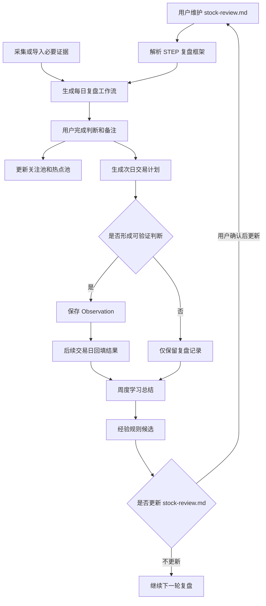

# 价值投机复盘助手当前项目需求文档

## 1. 背景与问题

上一版项目的问题是过早走向“全市场数据平台”和“候选池”，而用户真正需要的是围绕个人复盘框架进行盘后复盘、次日推演、热点跟踪和经验沉淀。

本项目重新收敛为一个“复盘与学习系统”：

- 以 `stock-review.md` 作为每日复盘主流程。
- 使用必要数据源补齐复盘证据，但不追求全市场覆盖。
- 围绕用户关注的 100-200 个股票维护关注池、热点池和潜在机会池。
- 每次复盘最后形成下一个交易日的交易计划。
- 把可验证判断沉淀为 Observation，并通过后续回填形成学习闭环。
- 使用规则、统计和 LLM 辅助总结经验，但不替代人工交易判断。

## 2. 产品定位

### 2.1 一句话定位

一个面向 A 股短线价值投机的本地优先 CLI 复盘系统，用于按 `stock-review.md` 完成盘后复盘、生成次日计划、跟踪热点池并沉淀可验证经验。

### 2.2 做什么

- 读取用户维护的 `stock-review.md`，按 `STEP N` 生成每日复盘工作流。
- 为每个复盘步骤补充市场、情绪、板块、个股和事件证据。
- 管理关注池、热点池、趋势强势池和潜在机会池。
- 输出下个交易日交易计划，包含符合预期、超预期、不及预期和放弃条件。
- 把复盘中的可验证判断保存为 Observation。
- 在后续交易日回填 Observation 结果。
- 周期性总结有效模式、误判模式和经验规则候选。
- 在证据充分时使用规则评分和历史统计辅助复盘。

### 2.3 不做什么

- 不做自动交易。
- 不做实时盯盘系统。
- 不做全市场行情平台。
- 不做普通资讯摘要工具。
- 不做纯机器选股候选池。
- 不让 LLM 替代事实证据和人工判断。
- MVP 不做 WebUI。
- MVP 不把任何单一第三方数据源作为不可替代前提。

## 3. 用户与使用场景

### 3.1 目标用户

用户是有自己交易框架和复盘习惯的个人投资者，关注 A 股短线、题材轮动、趋势强势票和价值投机机会。用户希望系统辅助自己复盘和学习，而不是替自己做买卖决策。

### 3.2 复盘时间口径

复盘默认针对最近一个已收盘交易日，不绑定固定时间。

- A 股收盘后可以生成初版复盘。
- 次日开盘前可以补充外围市场、美股夜盘、汇率、商品期货等可选信息。
- 同一交易日复盘文档允许更新，但必须保留覆盖交易日和生成/更新时间。
- 系统不得把 `stock-review.md` 中的“早晨 6 点”理解为硬编码业务规则。

### 3.3 核心场景

| 场景 | 时间 | 用户目标 | 系统输出 |
| --- | --- | --- | --- |
| 盘后复盘 | 收盘后或次日开盘前 | 按 `stock-review.md` 判断市场阶段、风格、情绪、主线、核心票 | 每日复盘 Markdown |
| 证据补充 | 复盘前或复盘中 | 补齐必要市场、情绪、板块、个股证据 | Evidence Snapshot |
| 热点池维护 | 复盘中 | 跟踪热点票、趋势牛股、短线强势票 | 热点池更新建议 |
| 次日计划 | 复盘末尾 | 明确下个交易日关注方向、触发条件和失效条件 | 交易计划 |
| 结果回填 | 后续交易日 | 判断计划和 Observation 命中、失败或无效 | 回填记录 |
| 周度学习 | 周末或阶段复盘 | 总结有效模式和反复误判 | 周度学习 Markdown |

## 4. 整体流程图



## 5. 数据原则

### 5.1 数据源是必要输入，但不是产品主线

没有数据源，复盘会变成主观日记；数据源过重，又会把系统带回全市场平台。因此本项目采用以下原则：

- 先由 `stock-review.md` 决定需要什么证据字段。
- 数据源只服务复盘步骤、关注池、热点池和次日计划。
- MVP 允许自动采集、半自动导入和手工补录共存。
- 数据不足时允许继续复盘，但必须明确显示缺口。
- 不为了数据完整性扩展到全市场扫描、实时盯盘或自动选股。

### 5.2 MVP 必要数据边界

- 市场层：上证、深成指、创业板等指数表现，两市成交额，涨跌家数。
- 情绪层：涨停数、跌停数、炸板率、连板高度、晋级率、昨日涨停/连板反馈、情绪温度等。
- 板块层：热点板块、主线题材、板块强度、涨停家数、板块成交或资金变化。
- 个股层：关注池内 100-200 个股票的行情、异动、涨停原因、所属板块、短线强度。
- 事件层：公告、新闻、涨停原因、催化逻辑和用户手工备注。
- 外围层：美股、汇率、黄金、大宗商品、期货等，仅在被热议或明显影响 A 股时纳入。

### 5.3 数据源候选

MVP 不绑定单一来源，优先抽象为适配器：

- 开盘啦或开盘啦相关第三方爬虫：适合短线情绪、涨停原因、连板梯队、热点题材。
- AKShare：适合公开行情和部分市场数据。
- Tushare 或其他专业数据源：适合稳定历史行情、指数、板块和财务数据。
- YAML/CSV/JSON 手工补录：作为兜底和样例数据来源。

真实接入任何第三方数据源前，必须单独核查当前文档、接口、授权、频率限制和失效风险。

## 6. 本地优先与存储原则

MVP 优先使用本地轻量存储：

- Markdown：每日复盘、次日计划、周度学习总结。
- YAML/JSON：配置、样例证据、经验规则。
- SQLite：结构化记录，包括证据快照、池子、计划、Observation 和回填结果。

除非明确需要同步或多设备访问，否则不优先引入云端数据库。

## 7. 功能拆解

### F1. 复盘框架读取

**目标**：读取用户维护的 `stock-review.md`，识别 `STEP N`，生成可填写工作流。

**输入**

- `stock-review.md`
- 交易日期

**输出**

- `reports/daily/YYYY-MM-DD_review.md`

**功能要求**

- 支持从 Markdown 标题中识别 `STEP N`。
- 保留用户原始步骤顺序和规则内容。
- 不硬编码 STEP 数量，允许用户后续增删改复盘步骤。
- 对系统暂时无法结构化识别的新规则，保留为人工判断项。
- 当框架格式无法识别时，给出明确错误提示。

**可测试条件**

- 给定当前 `stock-review.md`，生成结果必须包含实际识别到的全部 STEP；当前文件为 `STEP 1` 到 `STEP 10`。
- 给定新增 STEP 的 Markdown，生成结果必须包含新增章节。
- 给定无 STEP 的 Markdown，CLI 必须提示框架不可识别。

### F2. 必要证据采集与导入

**目标**：为复盘提供足够但不过量的事实证据。

**输入**

- 交易日期
- 数据源配置
- 关注池股票列表
- 热点池股票列表
- 手工事件或公告/新闻摘要

**输出**

- Evidence Snapshot。
- 数据可用性报告。

**功能要求**

- 支持样例 YAML/JSON 导入。
- 支持后续接入开盘啦、AKShare、Tushare 或其他专业数据源。
- 支持只采集关注池和热点池相关个股，不默认全市场扫描。
- 能显示实际样本日期、字段来源和证据缺口。
- 数据源失败时不得生成假结论。

**可测试条件**

- 缺指数、缺成交额、缺情绪、缺板块、缺个股时，必须分别提示。
- 只有一天行情时，报告必须提示历史样本不足。
- 有多日行情时，报告必须显示样本日期范围。
- 数据源失败时，CLI 返回非 0 或明确显示降级状态。

### F3. 每日复盘工作流生成

**目标**：按 `stock-review.md` 生成当天可填写的复盘 Markdown。

**输入**

- 交易日期
- 复盘框架
- Evidence Snapshot
- 关注池和热点池状态

**输出**

- 每日复盘 Markdown。

**功能要求**

- 每个 STEP 包含“原始规则”“自动证据”“人工判断”“待验证假设”“风险缺口”。
- 自动证据不能得出超出数据支持的结论。
- 数据不足时必须显示缺口，而不是生成模糊判断。
- 复盘结论必须区分事实、推断和未验证风险。
- 严格禁止编造消息、股票代码、板块归属或 K 线走势。

**可测试条件**

- 缺少历史量能时，报告显示 `missing_previous_amount`。
- 缺少板块映射时，只在相关步骤显示缺口，不全篇重复。
- 有指数数据时，STEP 1 显示指数表现和成交额变化。
- 没有证据来源的个股结论必须标记为待人工确认。

### F4. 关注池与热点池维护

**目标**：围绕有限股票池跟踪热点票、核心票、趋势强势票和潜在机会。

**输入**

- 股票代码和名称
- 关联板块
- 进入池子的原因
- 跟踪类型
- 跟踪开始日期
- 用户备注

**输出**

- 关注池、热点池、趋势强势池和潜在机会池记录。

**功能要求**

- 支持手工加入、更新状态、移出和作废。
- 支持从复盘结果生成“建议加入热点池”候选，但必须由用户确认。
- 记录每日表现和用户备注。
- 系统不替用户判断“走坏”，只提供证据和提醒。

**可测试条件**

- 重复加入同一股票时必须提示已有记录。
- 热点池记录必须包含进入原因和开始日期。
- 移出热点池必须保留历史跟踪记录。

### F5. 次日交易计划生成

**目标**：把复盘结论落到下一个交易日的可执行观察计划。

**输入**

- 每日复盘结论
- 核心板块和核心票
- 关注池和热点池状态

**输出**

- 结构化交易计划。
- Markdown 计划摘要。

**功能要求**

- 明确明日重点观察板块和股票。
- 每个计划项包含符合预期、超预期、不及预期和放弃条件。
- 每个计划项必须关联证据来源。
- 计划项可转为 Observation。
- 计划不是买卖指令，只是观察和应对框架。

**可测试条件**

- 缺少失效条件的计划项不能转为 Observation。
- 没有证据来源的计划项必须标记为待确认。
- 同一交易日允许生成初版和更新版计划，但必须记录更新时间。

### F6. Observation 生成与维护

**目标**：把复盘中可验证的判断保存为 Observation。

**输入**

- 复盘日期
- 判断主题
- 相关板块/个股
- 假设
- 成立条件
- 失效条件
- 证据来源
- 关联计划项

**输出**

- Observation 记录。

**功能要求**

- Observation 必须包含假设、成立条件、失效条件和证据来源。
- C 类弱催化、没有交易锚点或无法验证的内容不能进入 Observation。
- 支持手工创建、编辑、作废。
- 支持从次日计划中转化。

**可测试条件**

- 缺少成立条件时，保存失败。
- 缺少失效条件时，保存失败。
- 缺少证据来源时，保存失败或标记为待确认。
- 重复 Observation 能被识别。

### F7. Observation 回填

**目标**：在后续交易日回填判断结果，形成学习闭环。

**输入**

- Observation ID
- 实际结果
- 状态：命中、失败、无效、待观察
- 复盘备注

**输出**

- 更新后的 Observation。
- 回填记录。

**功能要求**

- 支持按日期列出待回填项。
- 支持记录命中/失败原因。
- 无效样本不得进入经验候选。
- 重复回填不应生成重复记录。

**可测试条件**

- pending 可以更新为 hit/miss/invalid。
- invalid 不进入周度经验候选。
- 重复回填同一 Observation 时必须更新原记录或明确提示。

### F8. 学习总结

**目标**：根据历史 Observation、计划回填和热点池跟踪整理经验候选。

**输入**

- 起止日期
- 已回填 Observation
- 交易计划回填
- 热点池跟踪记录
- 经验规则库

**输出**

- 周度学习 Markdown。
- 经验规则候选。

**功能要求**

- 区分命中样本、失败样本、无效样本。
- 总结有效判断模式。
- 总结反复误判原因。
- 输出经验候选，不自动修改 `stock-review.md`。
- 后续可用 LLM 辅助归纳，但必须引用历史记录和证据。

**可测试条件**

- hit/miss 进入经验候选。
- invalid 只作为无效说明，不进入经验候选。
- 无回填数据时，明确提示样本不足。

### F9. 可解释规则评分

**目标**：用可解释算法辅助复盘，而不是预测涨跌。

**输入**

- Evidence Snapshot

**输出**

- 市场状态识别。
- 板块强度评分。
- 个股角色标签。
- 买点模式疑似匹配。

**功能要求**

- 规则评分必须可解释，输出主要证据和缺口。
- 不输出黑盒买卖建议。
- 个股角色标签只允许来自数据源明确给出的板块领涨、涨停池连板等事实，不根据有限证据升级为核心票或龙头。
- 买点模式只输出“疑似观察模式”，必须展示竞价、分时、前一日反馈等缺口，不得写成确认买点。

**可测试条件**

- 相同输入必须产生稳定评分。
- 证据缺失时评分必须降级或提示不可判定。
- 疑似匹配结果必须能追溯到触发条件和缺口。

## 8. CLI 设计

MVP 只做 CLI。

### 8.1 命令草案

M2 当前已实现：

```powershell
.\.venv\Scripts\python.exe -m stock_review.cli framework check --file stock-review.md
.\.venv\Scripts\python.exe -m stock_review.cli review create --date 2026-07-06 --framework stock-review.md
```

M3 当前已实现：

```powershell
.\.venv\Scripts\python.exe -m stock_review.cli evidence import --date 2026-07-06 --file data/evidence/2026-07-06_sample.json
.\.venv\Scripts\python.exe -m stock_review.cli evidence check --date 2026-07-06
```

M3.5 当前已实现：

```powershell
.\.venv\Scripts\python.exe -m stock_review.cli review create --date 2026-07-06 --framework stock-review.md --evidence data/evidence/2026-07-06_snapshot.json
```

M4.1 当前已实现：

```powershell
.\.venv\Scripts\python.exe -m stock_review.cli pool add-watch --code 000001 --name 平安银行 --date 2026-07-06 --reason 样例关注 --exchange SZSE --sector 银行
.\.venv\Scripts\python.exe -m stock_review.cli pool add-hot --code 600519 --name 贵州茅台 --date 2026-07-06 --reason 样例热点 --exchange SSE --sector 白酒
.\.venv\Scripts\python.exe -m stock_review.cli pool list
```

M4.2 当前已实现：

```powershell
.\.venv\Scripts\python.exe -m stock_review.cli plan create --date 2026-07-06 --review reports/daily/2026-07-06_review.md --evidence data/evidence/2026-07-06_snapshot.json
```

M4.5 当前已实现：

```powershell
.\.venv\Scripts\python.exe -m stock_review.cli evidence collect --date 2026-07-06 --source akshare --scope market --output-dir data/evidence
```

M4.6 当前已实现：

```powershell
.\.venv\Scripts\python.exe -m stock_review.cli evidence collect --date 2026-07-06 --source akshare --scope sentiment --output-dir data/evidence
.\.venv\Scripts\python.exe -m stock_review.cli evidence collect --date 2026-07-06 --source akshare --scope sectors --output-dir data/evidence
```

M4.7 当前已实现：

```powershell
.\.venv\Scripts\python.exe -m stock_review.cli evidence collect --date 2026-07-06 --source akshare --scope stocks --output-dir data/evidence
```

M5 当前已实现：

```powershell
.\.venv\Scripts\python.exe -m stock_review.cli observation add --date 2026-07-06 --topic 机器人板块延续性 --target 机器人板块 --hypothesis 机器人板块次日保持强势 --confirmation 板块次日继续放量 --invalidation "板块跌幅超过 2%" --evidence-source "2026-07-06 Evidence Snapshot"
.\.venv\Scripts\python.exe -m stock_review.cli observation list --date 2026-07-06 --status pending
.\.venv\Scripts\python.exe -m stock_review.cli observation review --id OBS-20260706-001 --status hit --result "板块次日上涨 3%" --note 成立条件满足
```

M6.1 当前已实现：

```powershell
.\.venv\Scripts\python.exe -m stock_review.cli learning weekly --start 2026-07-06 --end 2026-07-10
```

M6.2.1 当前已实现：

```powershell
.\.venv\Scripts\python.exe -m stock_review.cli scoring create --date 2026-07-06 --evidence data/evidence/2026-07-06_snapshot.json
```

后续命令草案：

```powershell
.\.venv\Scripts\python.exe -m stock_review.cli init
```

### 8.2 CLI 验收标准

- 所有命令都有 `--help`。
- 失败时返回非 0 退出码。
- 失败提示要说明原因和下一步处理建议。
- 不输出密钥、数据库密码或 `.env` 原文。
- 真实数据源采集命令必须明确日期、数据源、范围和输出位置。

## 9. 技术架构

### 9.1 推荐技术栈

- Python 3.12 或 Python 3.13。
- M2 使用 Python 标准库 `argparse` 作为 CLI 入口；后续命令复杂后再评估 Typer。
- SQLite：本地结构化存储。
- Pydantic：输入和数据模型校验。
- YAML/JSON：配置、样例数据和经验规则。
- Markdown：复盘、计划和学习总结输出。
- M2 使用 Python 标准库 `unittest` 自动化测试；后续依赖安装稳定后再评估 pytest。
- OpenAI-compatible client：后续 LLM 归纳。

### 9.2 模块边界

```text
src/stock_review/
  cli.py
  review_framework/
    parse_framework.py
    build_review_document.py
  evidence/
    collect_evidence.py
    normalize_evidence.py
    kaipanla_source.py
    manual_source.py
  pools/
    manage_watch_pool.py
    manage_hot_pool.py
  planning/
    build_trade_plan.py
  observations/
    manage_observation.py
    review_observation.py
  learning/
    summarize_weekly_learning.py
  scoring/
    score_market_state.py
    match_trade_patterns.py
  storage/
    sqlite_repository.py
  reports/
    render_markdown.py
```

### 9.3 依赖方向

- CLI 层只负责参数解析和调用应用服务。
- 复盘框架解析层只读取 Markdown，不访问数据库和外部接口。
- Evidence source 只负责采集原始数据，统一交给 normalize 层转为标准证据。
- 计划、Observation、学习总结只依赖标准证据和本地 Repository，不直接调用第三方接口。
- 外部 HTTP/RPC 调用必须经过独立 source/client 层。

## 10. 存储设计要求

核心表或结构：

| 名称 | 用途 |
| --- | --- |
| `evidence_snapshots` | 每日复盘证据快照 |
| `watch_pool_items` | 用户关注池股票 |
| `hot_pool_items` | 热点池、趋势强势池和潜在机会池 |
| `review_documents` | 每日复盘文档索引 |
| `trade_plans` | 次日交易计划 |
| `observations` | 可验证假设 |
| `observation_reviews` | 回填结果 |
| `learning_notes` | 周度学习总结 |

## 11. MVP 验收标准

MVP 通过标准：

1. 可以在本地无云端数据库情况下完成初始化。
2. 可以读取当前 `stock-review.md` 并识别全部 STEP。
3. 可以用样例证据生成一份每日复盘 Markdown。
4. 报告能明确显示已使用样本日期、证据来源和证据缺口。
5. 可以维护关注池和热点池。
6. 可以生成一份包含条件和失效条件的次日交易计划。
7. 可以手工创建一条 Observation。
8. 可以回填 Observation 的命中、失败、无效或待观察状态。
9. 可以生成一份周度学习总结。
10. 核心流程有自动化测试或明确人工验证步骤。

## 12. 开发里程碑

### M1. 需求与流程固化

- 输出当前项目需求文档。
- 输出 README。
- 填写 AGENTS.md 项目架构红线。
- 明确 `stock-review.md` 是主流程来源。

验收：

- 文档中无模板占位符。
- PRD 中每个功能点都有可测试条件。
- 用户确认范围没有跑偏。

### M2. 复盘框架解析与报告生成

- 读取 `stock-review.md`。
- 动态识别 STEP。
- 生成每日复盘 Markdown。

验收：

- 当前 `stock-review.md` 的全部 STEP 都出现在报告中；当前文件实际为 10 个 STEP。
- 新增 STEP 后不需要改代码即可出现在报告中。

当前状态：

- 已完成最小 Python 项目骨架，主包名为 `stock_review`。
- 已实现 `framework check --file stock-review.md`。
- 已实现 `review create --date YYYY-MM-DD --framework stock-review.md`。
- 已添加匹配范围测试，覆盖当前 STEP 完整识别、无 STEP 明确报错、报告包含所有 STEP。
- 日报可通过 `--evidence` 消费 M3 Evidence Snapshot，自动证据只展示快照中的事实字段，不生成推断性结论。

### M3. 本地存储与样例证据

- 选择 SQLite。
- 定义最小数据结构。
- 准备离线样例数据。
- 生成 Evidence Snapshot。

验收：

- 无网络、无云端数据库时测试通过。
- 缺数据场景不会产生误导性结论。

当前状态：

- 已新增离线 JSON 样例证据 `data/evidence/2026-07-06_sample.json`。
- 已实现 Evidence Snapshot 标准化输出，默认写入 `data/evidence/YYYY-MM-DD_snapshot.json`。
- 已实现本地 SQLite 表 `evidence_snapshots`，保存交易日期、数据来源、样本日期、快照 JSON 和缺口字段。
- 已实现 `evidence import` 和 `evidence check` CLI。
- 已添加匹配范围测试，覆盖缺指数、缺成交额、缺情绪、缺板块、缺个股，以及样例导入和 SQLite 保存。
- 尚未接入真实数据源；当前样例只用于离线验证，不代表真实行情结论。

### M3.5. Evidence Snapshot 接入日报

- `review create` 支持可选 `--evidence` 参数。
- 日报顶部显示证据来源和样本日期。
- STEP 1 显示指数、两市成交额和涨跌家数。
- STEP 2/3 显示涨停数、跌停数、炸板率和连板高度。
- STEP 4/5 显示板块名称、状态和涨停家数。
- STEP 6/7 显示个股代码、名称、交易所、板块和角色。
- 无证据时保持原有待补充骨架。
- 缺口只在对应 STEP 展示，不全篇重复。

验收：

- 有样例证据时，报告显示来源、样本日期和关键字段。
- 无证据时，报告继续显示 `missing_evidence_snapshot`。
- 缺指数、成交额、情绪、板块、个股时，只在相关 STEP 显示缺口。
- 渲染层不生成市场阶段、买卖建议或未经证据支持的结论。

### M4. 关注池、热点池和次日计划

- 创建和维护关注池。
- 创建和维护热点池。
- 根据复盘生成次日交易计划。

验收：

- 计划项包含触发条件、超预期、不及预期和放弃条件。
- 热点池记录可查询、更新和保留历史。

### M4.1. 关注池和热点池最小管理

- `pool add-watch` 支持手工加入关注池。
- `pool add-hot` 支持手工加入热点池，进入原因必填。
- `pool list` 支持查看全部池子或按 `--type watch|hot` 过滤。
- 本地 SQLite 表 `pool_items` 保存池子类型、股票代码、名称、交易所、板块、进入原因、开始日期、状态和备注。
- 同一池子内重复加入同一股票时返回明确错误。
- 缺失交易所或板块时标记为待确认，不由系统编造。
- 当前不做自动推荐、移出、状态更新或次日计划生成。

验收：

- 能手工加入关注池记录。
- 能手工加入热点池记录，且热点池必须填写进入原因。
- 能查询关注池和热点池记录。
- 重复加入同一池子的同一股票会失败并提示已有记录。
- 写操作生成本地日志。

下一步：

- M4.2 生成次日计划：基于日报、Evidence Snapshot 和池子记录输出计划 Markdown。

### M4.2. 次日观察计划生成

- `plan create` 支持根据交易日期生成 `reports/daily/YYYY-MM-DD_plan.md`。
- 输入包含每日复盘 Markdown、可选 Evidence Snapshot 和本地池子记录。
- 计划顶部显示关联复盘、证据状态和计划边界。
- 每个池子对象生成一个计划项。
- 每个计划项包含符合预期、超预期、不及预期和放弃条件。
- 计划项关联池子类型、股票代码、名称、交易所、板块、进入原因和证据来源。
- 无池子记录时生成明确提示，不凭空生成观察对象。
- 当前不做买卖指令、自动交易建议、模式评分或 Observation 转化。

验收：

- 有池子记录时，计划包含对应观察对象。
- 每个计划项包含四类条件。
- 有 Evidence Snapshot 时，计划显示证据来源和样本日期。
- 无 Evidence Snapshot 时，计划项证据来源标记为待确认。
- 缺少每日复盘文档时，CLI 返回明确错误。
- 写操作生成本地日志。

下一步：

- M5 Observation 闭环：手工创建 Observation，并支持后续回填 hit/miss/invalid/pending。

### M4.5. AKShare 最小真实数据接入

- 新增 AKShare source，当前支持 `source=akshare`、`scope=market`。
- 采集范围显式限定为市场层，不默认全市场扫描。
- 当前采集上证指数、深证成指、创业板指日线事实。
- Evidence Snapshot 中保留数据来源、样本日期、指数收盘、涨跌幅和成交额字段。
- 成交额来自指数日线成交额求和，并在 `total_amount_source` 中标记来源。
- AKShare/东方财富指数接口在当前网络失败时，使用腾讯指数 K 线备用路径。
- 未安装 AKShare 时，CLI 返回明确错误和安装命令。
- 当前不采集短线情绪、板块题材、涨停原因或关注池个股行情，这些仍显示为证据缺口。

验收：

- `evidence collect` 必须显式传入交易日期、数据源、采集范围和输出目录。
- AKShare 未安装时，命令失败并提示 `python -m pip install -e .[data]`。
- mock AKShare 数据可生成标准 Evidence Snapshot。
- 生成的真实采集快照仍可被 `review create --evidence` 消费。

当前验证：

- 2026-07-08 已完成 2026-07-06 真实采集验证。
- `market` 已生成三大指数、涨跌幅和成交额字段。
- 东方财富直连可能因代理或远端断开失败，腾讯备用路径可补指数 K 线。

数据源备选记录：

- AKShare：当前首选，用于市场层和公开行情最小闭环。
- 开盘啦或同类短线情绪源：后续补涨停原因、连板梯队、题材强度和情绪温度，接入前需单独确认授权、稳定性和字段口径。
- Tushare：后续作为结构化历史行情和专业数据源备选，接入前需处理 token、权限和额度。
- Baostock：可作为历史行情兜底，不作为短线情绪首选。

### M4.6. 短线情绪和板块证据最小真实接入

#### M4.6.1 离线样例结构增强

- 扩展样例 Evidence Snapshot，增加 `emotion_temperature`、板块涨跌幅、板块成交额、核心票、个股涨跌幅和原因字段。
- 日报 STEP 2/3 展示情绪温度。
- 日报 STEP 4/5 展示板块涨跌幅、成交额、核心票等字段。
- 日报 STEP 6/7 展示个股涨跌幅和原因。

验收：

- 样例证据导入后 `missing_fields` 为空。
- 日报可展示新增字段。
- 样例结构只用于离线验证，不代表真实行情结论。

#### M4.6.2 短线情绪真实采集

- `evidence collect --scope sentiment` 支持 AKShare 东方财富涨停池、炸板池和跌停池。
- 真实采集字段包括涨停数、跌停数、炸板率和连板高度。
- 炸板率口径为炸板股池数量 / 当日触及涨停总数。
- 情绪温度暂无稳定真实来源，不再把它混入核心情绪缺口，单独输出 `missing_emotion_temperature`。
- 不把涨停池个股写入 `stocks`，避免过早生成核心票或买卖候选。

验收：

- `scope=sentiment` 会合并到同一交易日 Evidence Snapshot，不覆盖已有 `market`。
- 有涨停池、炸板池和跌停池数据时，`missing_sentiment` 消失。
- 情绪温度缺失时只显示 `missing_emotion_temperature`。

当前验证：

- 2026-07-08 已完成 2026-07-06 真实采集验证。
- 真实结果包含 `limit_up_count=64`、`limit_down_count=46`、`highest_board=5`、`broken_board_rate=0.3905`。

#### M4.6.3 板块证据真实采集

- `evidence collect --scope sectors` 支持 AKShare 东方财富概念/行业板块列表。
- 东方财富板块接口在当前网络失败时，兜底使用 AKShare 同花顺行业汇总。
- 真实采集字段包括板块名称、来源类型、涨跌幅、成交额、净流入、总成交量、上涨家数、下跌家数和领涨股。
- 概念和行业板块独立容错，单侧失败不阻断另一侧已有板块事实进入快照。
- 当前不写入核心票列表，不把领涨股直接当作可交易核心票。

验收：

- `scope=sectors` 会合并到同一交易日 Evidence Snapshot，不覆盖已有 `market` 或 `sentiment`。
- 只要任一板块源返回有效板块，`missing_sectors` 消失。
- 数据源失败事件写入 `events`，日报只展示已有事实和剩余缺口。

当前验证：

- 2026-07-08 已完成 2026-07-06 真实采集验证。
- 当前环境下东方财富板块接口失败，已使用同花顺行业汇总兜底。
- 日报 STEP 4/5 已展示油气开采及服务、旅游及酒店、IT 服务等板块事实。

### M4.7. 个股证据最小接入

下一步建议只补 `stocks`，但必须避免自动选股：

- 优先从已采集板块的领涨股和涨停池连板股中提取事实证据。
- 每条个股证据必须包含代码、名称、来源、所属板块或待确认标记、角色来源和涨跌幅。
- 只写入“事实候选”，不得输出买卖建议、核心票结论或自动加入关注池。
- 缺少股票代码、交易所或板块归属时必须标记待确认。
- `evidence collect --scope stocks` 会读取同交易日快照中已有板块领涨股，并调用东方财富涨停池提取连板数大于等于 2 的个股事实。
- 板块领涨股来源缺少代码和交易所时保留“待确认”，不额外扫描全市场补全。

验收：

- `missing_stocks` 能在有真实个股事实时消失。
- 日报 STEP 6/7 展示个股事实，但人工判断仍由用户填写。
- 不修改池子状态，不自动生成买卖计划。

当前状态：

- 已完成 `scope=stocks` 代码接入和离线测试。
- 已验证分 scope 合并不会覆盖已有 `market`、`sentiment` 和 `sectors`。
- 2026-07-09 已完成 2026-07-06 真实联网个股采集，共生成 13 条事实记录。
- `missing_stocks` 已消失，当前快照只剩 `missing_emotion_temperature`。

### M5. Observation 闭环

- `observation add` 支持手工创建 Observation，必须填写主题、假设、成立条件、失效条件和证据来源。
- `observation list` 支持按复盘日期和状态查询。
- `observation review` 支持回填实际结果、状态和复盘备注。
- 状态范围固定为 `pending`、`hit`、`miss`、`invalid`。
- 相同复盘日期、主题和假设的重复 Observation 会被拒绝。
- 重复回填同一 Observation 时更新原回填记录，不新增重复记录。

验收：

- Observation 可创建、更新、查询。
- invalid 不进入经验候选。
- 缺少成立条件、失效条件或证据来源时不能入库。

当前状态：

- 已完成业务模型、SQLite Repository 和 CLI 最小闭环。
- 已使用临时 SQLite 数据库验证创建、查询、重复识别、状态回填和重复回填更新。
- 当前仓库真实数据库尚未执行 Observation 建表或写入。

### M6.1. 周度学习总结

- `learning weekly` 按起止日期读取 Observation。
- 报告区分 `hit`、`miss`、`invalid` 和 `pending`。
- 只有 `hit` 和 `miss` 进入经验候选。
- `invalid` 只进入无效样本说明，`pending` 只进入待观察样本。
- 有效模式和反复误判主题只按已回填样本做确定性计数，不推断因果。
- 输出默认写入 `reports/weekly/`，不自动修改 `stock-review.md`。

验收：

- 能从样例 Observation 生成周度学习 Markdown。
- 无 hit/miss 时明确提示有效回填样本不足。
- 每条经验候选可追溯到 Observation ID 和证据来源。

当前状态：

- 已完成日期范围查询、Markdown 生成、CLI 和写操作日志。
- 已使用临时 SQLite 数据库验证命中、失败、无效和待观察分流。
- 当前真实数据库没有 Observation 样本，因此未生成真实周度学习报告。

### M6.2.1. 市场状态与板块强度评分

- 市场状态由指数正收益占比、涨停占涨跌停比例、封板稳定度和连板高度达标度四项等权计算。
- 市场标签固定为偏强、中性、偏弱或不可判定，不等同于牛熊判断或完整情绪周期。
- 板块强度由涨跌幅、上涨家数占比、净流入方向和领涨股涨跌幅计算。
- 板块报告显示得分、强中弱标签、证据覆盖率、逐项规则证据和缺口。
- 核心市场证据缺失时直接不可判定；板块证据覆盖率低于 50% 时不输出强弱标签。
- 评分报告只辅助复盘，不预测涨跌，不构成买卖建议。

验收：

- 相同输入产生稳定评分。
- 证据缺失时降级或提示不可判定。
- 每项得分可追溯到 Evidence Snapshot 字段。

当前状态：

- 已完成评分模型、Markdown 报告和 `scoring create` CLI。
- 已使用离线样例验证稳定评分和缺口降级，尚未生成真实评分报告。

### M6.2.2. 个股角色标签与买点模式疑似匹配

- 基于 Evidence Snapshot `stocks` 中的 `source`、`role_source`、`sector` 和涨跌幅生成个股角色标签。
- 当前允许的角色标签包括板块领涨、连板股和连板高度事实候选。
- 基于已采集板块强度和连板事实输出买点模式疑似匹配，例如板块领涨疑似观察模式、连板接力疑似观察模式。
- 疑似模式必须同时展示规则证据和缺口；缺少竞价、分时、前一日反馈时不得确认买点。
- 不修改关注池、热点池、交易计划或 Observation，不生成买卖建议。

验收：

- 同一 Evidence Snapshot 生成稳定的个股角色标签和疑似模式。
- 缺少代码、交易所、板块、竞价、分时或前一日反馈时必须展示缺口。
- 报告必须明确疑似模式不是确认买点，不构成买卖建议。

当前状态：

- 已在 `scoring create` 报告中加入个股角色与疑似观察模式章节。
- 已添加离线测试覆盖板块领涨、连板股、连板高度事实候选和证据缺口。

### M7. 数据源增强

- 验证开盘啦、AKShare、Tushare 或专业数据源。
- 将稳定数据源接入 evidence source。
- 保留样例数据和手工补录兜底。

验收：

- 接入前已说明数据源、授权、频率、字段、风险和验证证据。
- 数据源失败时复盘仍可显示缺口并继续人工判断。

#### M7.1. AKShare 采集稳定性最小闭环

- 同交易日、同 scope 的有效 AKShare Evidence Snapshot 默认复用，避免重复请求；用户显式传入 `--refresh` 才允许重新联网采集。
- 单次 scope 采集内连续 AKShare 请求固定间隔 0.3 秒，不使用自动重试扩大请求量。
- 失败信息按 `rate_limited`、`network_timeout`、`access_denied` 或 `upstream_unavailable` 分类；分类只描述异常表象，不认定 IP 已被封禁。
- 保持已有东方财富、腾讯和同花顺降级路径；失败时继续保留已存在事实和缺口，不生成推断结论。

验收：

- 同一有效 scope 重复执行时不触发新的数据源调用。
- 显式 `--refresh` 时才重新调用数据源。
- 节流与失败分类有离线单元测试。

当前状态：

- 已完成快照复用、显式刷新入口、固定节流和失败分类的离线实现与测试。
- 2026-07-11 已在本地开发环境完成 `market` scope 的 `--refresh` 真实验证：AKShare 与东方财富路径失败时，腾讯指数 K 线备用路径成功生成快照；快照、SQLite 记录和本地日志已回查一致。

#### M7.2. 候选短线情绪数据源可用性评估

- 对候选数据源分别记录授权方式、可获取字段、请求频率、稳定性、失败表现和复盘适配范围。
- 评估只覆盖服务 `stock-review.md`、关注池或热点池的最小字段，不扩展为全市场扫描。
- 开盘啦、Tushare 或其他候选源未通过评估时，只保留失败结论和人工补录兜底，不接入生产代码。
- 只有字段口径、授权边界和稳定性均明确的数据源，才能另立任务接入 `evidence source`。

验收：

- 每个已评估数据源都有可追溯的验证日期、字段结论、失败或限制说明。
- 明确短线情绪字段是否可补齐 `missing_emotion_temperature`，不能补齐时保持该缺口。
- 评估过程不修改真实 Evidence Snapshot、SQLite 数据或远端服务状态。

当前状态：

- 2026-07-11：AKShare 已可提供涨停数、跌停数、炸板率和连板高度，但不能稳定提供情绪温度，继续保留 `missing_emotion_temperature`。
- 2026-07-11：开盘啦网页版尚未形成可用数据源，无法确认可自动采集的授权、稳定性和字段口径。
- 2026-07-11：Tushare 官方文档列出连板天梯、涨跌停和板块资金流向等短线字段，其中连板天梯要求 8000 积分。本地使用 `.env` 的 token 对 `limit_step` 发起单次 HTTPS 只读请求，返回 `40203`（无接口访问权限）；该接口也只提供连板数，不能直接补齐情绪温度。当前 token 的 `daily` 日线权限不能替代短线情绪数据源。
- 结论：当前没有可新增接入的短线情绪数据源；不新增 source、不安装依赖，继续以 AKShare 已有事实和手工补录保留缺口。

### M8. 单日复盘闭环验收

- 使用一个明确交易日的 Evidence Snapshot 或人工补录证据，按既有 CLI 完成复盘、池子维护、次日计划、Observation 创建和后续回填。
- 逐项回查日报、计划、Observation、周度学习总结和本地日志之间的日期、证据来源与记录 ID。
- 发现证据缺口时保留待确认标记，不用推断或补写买卖建议。

验收：

- 单日流程可从 `stock-review.md` 走到至少一条可追溯的 Observation。
- 生成物和日志均能对应同一交易日期与证据来源。
- 只使用本地开发环境、有限股票池和显式输入，不调用自动交易、实时盯盘或全市场采集。

当前状态：

- 2026-07-11 已在本地开发环境使用 `2026-07-10` AKShare Evidence Snapshot 完成日报、次日计划、Observation 创建与回填、周度学习总结的单日闭环。
- 快照缺少短线情绪、板块和个股字段时，日报保留 `missing_sentiment`、`missing_sectors` 和 `missing_stocks`，未生成买卖建议。
- 验收 Observation 为 `OBS-20260710-001`，明确标记为系统验收样例并回填 `invalid`；周度学习总结将其归入无效样本，不进入经验候选。
- SQLite 记录、本地日志和输出文件均已按交易日期与证据来源回查一致。

### M9. 阶段性基线收口

M9 不再定义为“产品已经可以交付使用”，而是对 M1-M8 形成的工程基础、验证资产和真实缺口做阶段性收口，为后续真实复盘能力开发提供稳定基线。

- 汇总最小启动、数据源边界、离线样例、失败降级和全量测试命令。
- 区分“CLI 链路已经实现”和“真实复盘效果已经可用”，不得用模板可生成代替真实业务验收。
- 整理本地 SQLite 数据、报告目录、日志和验证样例的备份、恢复与清理说明。
- 记录 M1-M8 的保留能力、待扩展能力和验证样例，不引入云端数据库、WebUI 或后台 worker。

验收：

- 新环境可按文档完成离线最小验证。
- 已通过能力有匹配范围测试或明确人工验证证据。
- 验证样例、真实业务数据和未实现能力被明确区分。
- M9 收口不宣称已经满足 `stock-review.md` 的完整日常复盘效果。

当前状态：

- 已新增 `docs/LOCAL_DATA_OPERATIONS.md`，明确离线样例、真实采集快照、本地业务库、报告和日志的分类口径。
- 已记录离线最小验证、仓库外备份、恢复前置检查和清理授权边界。
- 已明确 M8 产物属于系统验收样例，不代表真实复盘已经可用。
- M9 已完成阶段性基线收口，后续进入 M10.1。

#### M1-M8 资产复用结论

M1-M8 不是无用功，它们建立了后续真实复盘能力所需的基础，但部分输出仍是骨架或验证样例：

| 既有里程碑 | 可继续复用的资产 | 后续仍需补齐 |
| --- | --- | --- |
| M1-M2 | 项目边界、动态 STEP 解析、Markdown 报告入口 | 框架版本、语义标识和变更校验 |
| M3-M3.5 | Evidence Snapshot、缺口标记、SQLite、证据日报 | 更完整的时序证据与 STEP 语义映射 |
| M4 | 池子与计划的数据入口、四类条件骨架 | 真实池子生命周期、结构化人工条件和复盘关联 |
| M5-M6.1 | Observation、回填和周度学习链路 | 真实 `hit`/`miss` 样本与规则提案审核 |
| M6.2 | 可解释评分与疑似模式的离线规则 | 更完整证据输入；评分不能替代人工判断 |
| M7 | AKShare 真实采集、降级、节流、失败分类和数据源限制结论 | 每日稳定性、连续历史和缺失数据源 |
| M8 | 单日端到端链路验证 | 当前仅为系统验收样例，不代表真实复盘已完成 |

### M10. 真实复盘与持续学习能力（后续开发，未开始）

`stock-review.md` 是用户持续维护、持续修正的现行复盘规则库，不是固定模板。M10 必须同时覆盖当前 10 个 STEP 的真实使用效果，以及复盘结果反向形成规则候选、经用户确认后更新框架的学习闭环。

#### M10 的 10 STEP 能力映射

| STEP | 目标能力 | 当前主要缺口 |
| --- | --- | --- |
| STEP 1 大盘阶段 | 指数、量能、涨跌家数、外围市场和连续阶段证据 | 涨跌家数、外围事实和历史阶段证据不足 |
| STEP 2 市场风格 | 趋势/情绪连板风格所需的大市值趋势、连板梯队、容量中军和活跃资金事实 | 现有数据不足以形成完整风格证据链 |
| STEP 3 情绪周期 | 涨跌停、炸板、连板、晋级率、昨日反馈、竞价和情绪温度 | 只有部分指标且每日稳定性不足 |
| STEP 4 核心板块 | 5-10 日反复活跃、趋势、量能和强度证据 | 只有偶发单日板块列表 |
| STEP 5 主升板块阶段 | 板块启动、主升、首次回调、轮动和破位的连续 K 线证据 | 尚无可回查的阶段识别链路 |
| STEP 6 核心票 | 逆势领涨、容量中军、连板高度、5/20 日表现和身份验证 | 当前只有有限事实候选，不能认定核心票 |
| STEP 7 重点关注 | 从真实池子和人工复盘结论形成少量次日关注对象 | 已有真实池与人工 STEP 记录入口，尚未形成显式计划关联 |
| STEP 8 预演 | 对大盘、板块和个股保存符合、超预期、不及预期及应对 | 已可保存经用户确认的四类条件，尚未保存 STEP 10 最终应对 |
| STEP 9 模式核验 | 对 12 类模式逐项核验日线、竞价、分时、板块联动和历史反馈 | 疑似匹配覆盖有限，多数关键证据缺失 |
| STEP 10 最终输出 | 汇总事实、人工判断、关注对象、条件、风险和用户确认的应对 | 缺少结构化保存与后续回填关联 |

#### M10.1. 时序证据底座与真实池子

**目标**：稳定保存当前 10 个 STEP 所需的当日和历史事实，并维护用户真实关注池、热点池、趋势强势池和潜在机会池。

- 每次采集必须显式声明交易日期、数据源和范围；失败时保留已有事实、缺口与失败类别。
- 市场层补充涨跌家数和按需纳入的外围证据；情绪层补充晋级率、昨日涨停/连板反馈、竞价和可验证的情绪指标。
- 板块层保存连续 5-10 个交易日及更长阶段所需的涨跌幅、量能、内部表现、领涨股和来源。
- 个股层只围绕板块事实和用户有限股票池补充行情、角色来源、5/20 日表现及身份字段，不默认扫描全市场。
- 样例池和真实池必须明确区分；池子支持人工加入、`active|paused|removed` 状态更新、移出原因和完整历史保留。

验收：

- 一个明确交易日可回查 STEP 1-6 的已有事实与明确缺口。
- 历史充足时可展示当日强势板块、近期反复活跃板块及逐日证据；历史不足时不得认定核心板块。
- 对只提供最近交易日快照的数据源，允许从首次成功采集起连续积累；至少收集 5 个有效交易日后才启用历史分析，禁止把最新快照回填为旧日期。
- 真实池子记录与 Evidence Snapshot、日报和日志按日期、对象和来源关联。

当前状态：

- 已新增 `evidence sector-history --start --end`，只读取明确日期范围内的本地 Evidence Snapshot。
- 报告按快照已有涨跌幅输出每日最强板块事实，并列出缺少板块证据的快照日期。
- 近期反复活跃候选至少需要 5 个有效板块交易日；历史不足时明确提示数据不足，不认定核心板块。
- 已新增 `evidence market-history --start --end`，只读取明确日期范围内的本地 Evidence Snapshot，输出每日指数、成交额和市场证据缺口。
- 指数区间涨跌事实至少需要 5 个有效市场交易日；历史不足时明确提示数据不足，不判断市场阶段。
- 已使用 `2026-07-06` 至 `2026-07-10` 本地快照验证：2 个快照中只有 1 个包含板块证据，`2026-07-06` 当日涨幅最高板块为油气开采及服务，`2026-07-10` 保留 `missing_sectors`，因此未输出近期候选。
- 已新增 `evidence collect-daily`，用户必须显式重复传入所需 `--scope`；每个 scope 独立执行，部分失败会继续后续 scope 并以非零状态、日志和汇总结果提示未完成。
- 2026-07-11 已在本地开发环境完成 `2026-07-10` 的真实联调：`market`、`sentiment`、`sectors` 和 `stocks` 已合并到同日快照；SQLite 回查一致，剩余唯一缺口为 `missing_emotion_temperature`。
- 已新增 `pool update-status` 和 `pool history`：用户可显式更新 `active|paused|removed`，每次变更必须填写原因，移出不删除主记录，并可回查加入、暂停、移出和重新启用历史。
- 已使用临时 SQLite 完成加入、暂停、历史查询和只读回查验证；查询历史不会创建表或执行迁移。
- 当前只完成市场与板块历史事实、显式单日多 scope 采集和池子生命周期子闭环；连续交易日稳定采集、其他 STEP 时序证据和真实池子记录仍未完成。
- hhxg 公开快照已完成 2026-07-10 真实验证，可提供涨停、炸板、跌停、连板梯队和板块排行；公开接口不支持历史日期回补，返回日期不一致时必须失败，待连续采集满 5 个有效交易日后再用于历史分析。
- 已新增只读 `evidence history-readiness --source hhxg --start --end`：仅统计交易日期与样本日期一致、且存在 hhxg 来源事件的本地快照；少于 5 个有效交易日时明确阻止历史分析，并逐日展示合并快照缺口与 hhxg 固有字段缺口。
- 已新增 `evidence hhxg-history --start --end`：只汇总 hhxg 已提供的涨跌停、炸板率、连板高度、热门题材和行业强弱排行；少于 5 个有效交易日时只生成数据不足报告，不输出多日历史分析结论。
- 新采集的 Evidence Snapshot 已记录 market、sentiment、sectors 和 stocks 的字段来源；同日合并不会再以最后写入的顶层来源覆盖字段溯源，旧快照因缺少该元数据保持待确认。
- 已新增只读 `pool candidates --date --snapshot-dir`：从本地快照分别展示可确认代码的个股事实候选、缺代码个股事实和 hhxg 题材/行业排行；命令不自动写入池子或认定核心票。
- 池子记录已区分 `real|sample`；新建记录默认 `real`，次日计划只读取 `real`，样例记录仍可显式查看、暂停或移出但不会混入真实计划。
- 已新增 `evidence collect-pool-history --date --source akshare --output-dir`：只请求真实池代码的日线，输出收盘、成交量、成交额及 5/20 日区间事实；窗口不足时保留缺口，不扫描全市场或认定核心票。
- 池子对象支持最多 3 个人工确认板块；`pool migrate-sectors` 将旧 `pool_items.sector` 显式迁移为 `pool_item_sectors` 关联，保留原对象、状态、记录类型和原板块事实。

#### M10.2. 基于证据的复盘事实归纳

**目标**：为 STEP 1-7 生成可解释的事实摘要和候选标签，帮助用户判断大盘阶段、市场风格、情绪周期、板块阶段和个股角色，但不替用户作最终交易结论。

- 每个候选结论必须列出使用字段、样本窗口、规则条件、缺失字段和反向证据。
- 数据不足时输出不可判定或待确认，不使用单日涨幅认定核心板块、主升阶段或核心票。
- 评分、角色标签和模式匹配只能作为证据摘要，不自动修改池子、计划或 Observation。

验收：

- 相同输入产生稳定、可追溯的候选结果。
- 任一候选标签可以追溯到具体 Evidence Snapshot 字段与日期。
- 缺少关键证据时不会输出确定性阶段、核心票或买点结论。

当前状态：

- 已新增只读 `evidence summarize-review --date --snapshot-dir --pool-history-dir --output-dir`：按 STEP 1-7 输出已有字段、字段来源、缺口和反向证据。
- 当日快照标准字段完整不等于 STEP 判断证据完整；连续时序不足、晋级率、竞价、身份验证等缺口仍明确保留为待确认或不可判定。
- 该命令不修改池子、计划、Observation 或 SQLite，也不输出市场阶段、核心板块、核心票或买点结论。

#### M10.3. 结构化人工复盘与计划工作流

**目标**：让用户的 STEP 判断、重点关注、预演和最终应对不再只停留在手改 Markdown，而能保存、关联和回查。

- 每个 STEP 可保存人工判断、待验证假设、证据引用和备注。
- STEP 7 的重点关注对象必须来自用户真实池子或用户明确确认的候选，不自动加入池子。
- STEP 8 和 STEP 10 保存符合预期、超预期、不及预期、放弃条件、风险边界和用户确认的应对。
- Observation 必须由用户明确创建，并关联对应 STEP、计划项、对象和 Evidence Snapshot。
- Markdown 继续作为可阅读输出，结构化记录作为回填和学习的事实来源。

验收：

- 用户可完成一次从 STEP 判断、重点关注、预演、最终输出到 Observation 创建的记录链路。
- 任意计划项和 Observation 可追溯至人工判断与证据来源。
- 未经用户确认的候选不会写成事实、持仓决定或买卖指令。

当前状态：

- 已新增 `review record-step`：保存用户的单个 STEP 人工判断、可选待验证假设、证据引用和备注。
- 已新增 `review record-preview`：保存用户显式确认的 STEP 8 符合预期、超预期、不及预期和放弃条件；未传入确认参数时拒绝写入。
- 已新增只读 `review build-context`：汇总当天 Evidence Snapshot、人工 STEP 记录、STEP 8 预演和 `active + real` 池子对象；空池或缺少输入时只显示待补状态，不补充候选或交易结论。
- 尚未实现 STEP 10 正式输出、人工记录与计划项/Observation 的显式关联，以及任何 LLM 草案或自动写入。

#### M10.4. STEP 9 模式逐项核验

**目标**：将 `stock-review.md` STEP 9 的模式拆成可验证条件，而不是仅输出宽泛的疑似匹配。

- 每个模式分别定义必要证据、满足条件、缺失条件、失效条件和需要人工确认的内容。
- 日线、竞价、分时或板块联动证据缺失时，不确认买点。
- 模式结果只服务人工复盘和 Observation，不自动生成交易指令。

验收：

- 每个已支持模式都有独立测试和证据缺口测试。
- 报告能区分已满足事实、待确认条件和明确不满足条件。

#### M10.5. 真实样本驱动的学习总结

**目标**：积累连续数周的真实 `hit`/`miss` Observation，形成可复查的经验候选和规则修改候选。

- 只统计用户真实创建并回填的 Observation；系统验收样例、`invalid` 和 `pending` 不进入经验候选。
- 周度和阶段总结展示有效样本量、命中/失败分布、Observation ID、证据来源、适用条件和反例。
- 样本不足时只报告不足，不推断因果关系或买卖规则。

验收：

- 多条真实 `hit`/`miss` 样本可正确分组并追溯到原始记录。
- 经验候选同时展示支持样本和失败/反例，不以单次命中形成规则。

#### M10.6. 复盘框架版本与人工确认更新

**目标**：让 `stock-review.md` 可以持续演进，同时保证旧复盘可还原、规则变更有证据、任何更新由用户确认。

- `stock-review.md` 继续保存当前生效规则；经验候选和框架历史不得混入当前规则正文。
- 每份日报记录框架版本、内容摘要和 STEP 语义标识，保证后续可还原当时使用的规则。
- 规则修改候选必须包含来源 Observation、样本区间、支持样本、反例、适用条件和拟修改位置。
- 候选状态至少包含 `proposed`、`accepted`、`rejected` 和 `deferred`；只有用户明确接受后才允许更新 `stock-review.md`。
- STEP 新增、删除、重排或语义变化后，必须重新校验证据映射；禁止继续仅按 STEP 编号静默映射。
- 系统不得自动覆盖、删除或改写用户当前规则。

验收：

- 旧日报可回查其使用的框架版本和内容摘要。
- 用户可以查看规则候选及证据，并明确接受、拒绝或暂缓。
- 用户接受规则变更后，框架校验和证据映射测试通过；拒绝或暂缓不会修改现行规则。

#### 推进顺序与停止条件

- 第一阶段：M9 收口现有基线，明确验证样例与真实数据边界。
- 第二阶段：M10.1 → M10.2 → M10.3，先解决真实证据、可解释归纳和人工复盘工作流。
- 第三阶段：M10.4 → M10.5 → M10.6，在数据和真实记录足够后补模式核验、学习总结和框架演进。
- 任一阶段只完成当前最小闭环；数据不足、样本不足或需要用户交易判断时必须停止并保留待确认状态。

## 13. 风险与控制

| 风险 | 控制方式 |
| --- | --- |
| 再次跑向全市场数据平台 | 每次新增采集前确认是否服务 `stock-review.md` 的 STEP 或池子 |
| 数据不足却生成结论 | 报告必须显示证据缺口，结论区分事实、推断和未验证风险 |
| 数据源不稳定或接口变化 | 数据源放在独立适配器，保留样例数据和补录兜底 |
| 过早引入 WebUI | CLI 稳定前不做 UI |
| 云端数据库增加复杂度 | MVP 默认 SQLite 本地存储 |
| LLM 产生幻觉 | LLM 只能基于历史记录和证据归纳，不得编造事实 |
| 复盘框架继续变化 | 框架读取动态识别 STEP，不硬编码步骤 |
| AI 把计划写成买卖指令 | 计划必须表达观察条件和应对框架，不直接替用户决策 |
| 杂毛票被误识别为核心 | 角色标签和疑似模式必须基于数据源明确事实，并明确不得认定核心票、龙头或确认买点 |

## 14. 后续扩展

MVP 稳定后再考虑：

- WebUI。
- Notion 同步。
- LLM 辅助归纳历史相似场景。
- 更完整的数据源自动采集。
- 多账户或多设备同步。
- 盘中提醒或轻量监控。

扩展前必须重新确认：是否服务“复盘、计划、跟踪、学习”，而不是把项目重新带回资讯平台、行情平台或自动选股系统。
