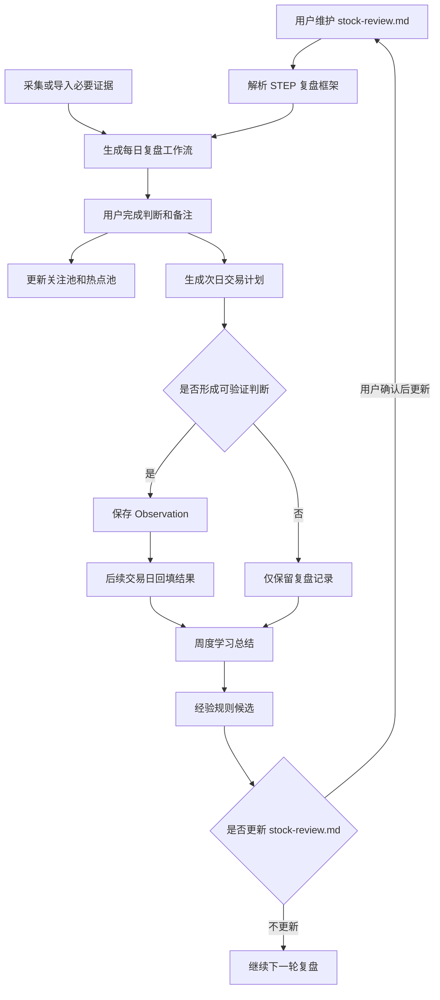

# 价值投机复盘助手当前项目需求文档

## 1. 背景与问题

上一版项目的问题是过早走向“全市场数据平台”和“候选池”，而用户真正需要的是围绕个人复盘框架进行盘后复盘、次日推演、热点跟踪和经验沉淀。

本项目重新收敛为一个“复盘与学习系统”：

- 以 `stock-review.md` 作为每日复盘主流程。
- 使用必要数据源补齐复盘证据，但不追求全市场覆盖。
- 围绕用户关注的 100-200 个股票维护关注池、热点池和潜在机会池。
- 每次复盘最后形成下一个交易日的交易计划。
- 把可验证判断沉淀为 Observation，并通过后续回填形成学习闭环。
- 使用规则、统计和 LLM 辅助总结经验，但不替代人工交易判断。

## 2. 产品定位

### 2.1 一句话定位

一个面向 A 股短线价值投机的本地优先 CLI 复盘系统，用于按 `stock-review.md` 完成盘后复盘、生成次日计划、跟踪热点池并沉淀可验证经验。

### 2.2 做什么

- 读取用户维护的 `stock-review.md`，按 `STEP N` 生成每日复盘工作流。
- 为每个复盘步骤补充市场、情绪、板块、个股和事件证据。
- 管理关注池、热点池、趋势强势池和潜在机会池。
- 输出下个交易日交易计划，包含符合预期、超预期、不及预期和放弃条件。
- 把复盘中的可验证判断保存为 Observation。
- 在后续交易日回填 Observation 结果。
- 周期性总结有效模式、误判模式和经验规则候选。
- 在证据充分时使用规则评分、模式匹配和历史统计辅助复盘。

### 2.3 不做什么

- 不做自动交易。
- 不做实时盯盘系统。
- 不做全市场行情平台。
- 不做普通资讯摘要工具。
- 不做纯机器选股候选池。
- 不让 LLM 替代事实证据和人工判断。
- MVP 不做 WebUI。
- MVP 不把任何单一第三方数据源作为不可替代前提。

## 3. 用户与使用场景

### 3.1 目标用户

用户是有自己交易框架和复盘习惯的个人投资者，关注 A 股短线、题材轮动、趋势强势票和价值投机机会。用户希望系统辅助自己复盘和学习，而不是替自己做买卖决策。

### 3.2 复盘时间口径

复盘默认针对最近一个已收盘交易日，不绑定固定时间。

- A 股收盘后可以生成初版复盘。
- 次日开盘前可以补充外围市场、美股夜盘、汇率、商品期货等可选信息。
- 同一交易日复盘文档允许更新，但必须保留覆盖交易日和生成/更新时间。
- 系统不得把 `stock-review.md` 中的“早晨 6 点”理解为硬编码业务规则。

### 3.3 核心场景

| 场景 | 时间 | 用户目标 | 系统输出 |
| --- | --- | --- | --- |
| 盘后复盘 | 收盘后或次日开盘前 | 按 `stock-review.md` 判断市场阶段、风格、情绪、主线、核心票 | 每日复盘 Markdown |
| 证据补充 | 复盘前或复盘中 | 补齐必要市场、情绪、板块、个股证据 | Evidence Snapshot |
| 热点池维护 | 复盘中 | 跟踪热点票、趋势牛股、短线强势票 | 热点池更新建议 |
| 次日计划 | 复盘末尾 | 明确下个交易日关注方向、触发条件和失效条件 | 交易计划 |
| 结果回填 | 后续交易日 | 判断计划和 Observation 命中、失败或无效 | 回填记录 |
| 周度学习 | 周末或阶段复盘 | 总结有效模式和反复误判 | 周度学习 Markdown |

## 4. 整体流程图



## 5. 数据原则

### 5.1 数据源是必要输入，但不是产品主线

没有数据源，复盘会变成主观日记；数据源过重，又会把系统带回全市场平台。因此本项目采用以下原则：

- 先由 `stock-review.md` 决定需要什么证据字段。
- 数据源只服务复盘步骤、关注池、热点池和次日计划。
- MVP 允许自动采集、半自动导入和手工补录共存。
- 数据不足时允许继续复盘，但必须明确显示缺口。
- 不为了数据完整性扩展到全市场扫描、实时盯盘或自动选股。

### 5.2 MVP 必要数据边界

- 市场层：上证、深成指、创业板等指数表现，两市成交额，涨跌家数。
- 情绪层：涨停数、跌停数、炸板率、连板高度、晋级率、昨日涨停/连板反馈、情绪温度等。
- 板块层：热点板块、主线题材、板块强度、涨停家数、板块成交或资金变化。
- 个股层：关注池内 100-200 个股票的行情、异动、涨停原因、所属板块、短线强度。
- 事件层：公告、新闻、涨停原因、催化逻辑和用户手工备注。
- 外围层：美股、汇率、黄金、大宗商品、期货等，仅在被热议或明显影响 A 股时纳入。

### 5.3 数据源候选

MVP 不绑定单一来源，优先抽象为适配器：

- 开盘啦或开盘啦相关第三方爬虫：适合短线情绪、涨停原因、连板梯队、热点题材。
- AKShare：适合公开行情和部分市场数据。
- Tushare 或其他专业数据源：适合稳定历史行情、指数、板块和财务数据。
- YAML/CSV/JSON 手工补录：作为兜底和样例数据来源。

真实接入任何第三方数据源前，必须单独核查当前文档、接口、授权、频率限制和失效风险。

## 6. 本地优先与存储原则

MVP 优先使用本地轻量存储：

- Markdown：每日复盘、次日计划、周度学习总结。
- YAML/JSON：配置、样例证据、经验规则。
- SQLite：结构化记录，包括证据快照、池子、计划、Observation 和回填结果。

除非明确需要同步或多设备访问，否则不优先引入云端数据库。

## 7. 功能拆解

### F1. 复盘框架读取

**目标**：读取用户维护的 `stock-review.md`，识别 `STEP N`，生成可填写工作流。

**输入**

- `stock-review.md`
- 交易日期

**输出**

- `reports/daily/YYYY-MM-DD_review.md`

**功能要求**

- 支持从 Markdown 标题中识别 `STEP N`。
- 保留用户原始步骤顺序和规则内容。
- 不硬编码 STEP 数量，允许用户后续增删改复盘步骤。
- 对系统暂时无法结构化识别的新规则，保留为人工判断项。
- 当框架格式无法识别时，给出明确错误提示。

**可测试条件**

- 给定当前 `stock-review.md`，生成结果必须包含实际识别到的全部 STEP；当前文件为 `STEP 1` 到 `STEP 10`。
- 给定新增 STEP 的 Markdown，生成结果必须包含新增章节。
- 给定无 STEP 的 Markdown，CLI 必须提示框架不可识别。

### F2. 必要证据采集与导入

**目标**：为复盘提供足够但不过量的事实证据。

**输入**

- 交易日期
- 数据源配置
- 关注池股票列表
- 热点池股票列表
- 手工事件或公告/新闻摘要

**输出**

- Evidence Snapshot。
- 数据可用性报告。

**功能要求**

- 支持样例 YAML/JSON 导入。
- 支持后续接入开盘啦、AKShare、Tushare 或其他专业数据源。
- 支持只采集关注池和热点池相关个股，不默认全市场扫描。
- 能显示实际样本日期、字段来源和证据缺口。
- 数据源失败时不得生成假结论。

**可测试条件**

- 缺指数、缺成交额、缺情绪、缺板块、缺个股时，必须分别提示。
- 只有一天行情时，报告必须提示历史样本不足。
- 有多日行情时，报告必须显示样本日期范围。
- 数据源失败时，CLI 返回非 0 或明确显示降级状态。

### F3. 每日复盘工作流生成

**目标**：按 `stock-review.md` 生成当天可填写的复盘 Markdown。

**输入**

- 交易日期
- 复盘框架
- Evidence Snapshot
- 关注池和热点池状态

**输出**

- 每日复盘 Markdown。

**功能要求**

- 每个 STEP 包含“原始规则”“自动证据”“人工判断”“待验证假设”“风险缺口”。
- 自动证据不能得出超出数据支持的结论。
- 数据不足时必须显示缺口，而不是生成模糊判断。
- 复盘结论必须区分事实、推断和未验证风险。
- 严格禁止编造消息、股票代码、板块归属或 K 线走势。

**可测试条件**

- 缺少历史量能时，报告显示 `missing_previous_amount`。
- 缺少板块映射时，只在相关步骤显示缺口，不全篇重复。
- 有指数数据时，STEP 1 显示指数表现和成交额变化。
- 没有证据来源的个股结论必须标记为待人工确认。

### F4. 关注池与热点池维护

**目标**：围绕有限股票池跟踪热点票、核心票、趋势强势票和潜在机会。

**输入**

- 股票代码和名称
- 关联板块
- 进入池子的原因
- 跟踪类型
- 跟踪开始日期
- 用户备注

**输出**

- 关注池、热点池、趋势强势池和潜在机会池记录。

**功能要求**

- 支持手工加入、更新状态、移出和作废。
- 支持从复盘结果生成“建议加入热点池”候选，但必须由用户确认。
- 记录每日表现和用户备注。
- 系统不替用户判断“走坏”，只提供证据和提醒。

**可测试条件**

- 重复加入同一股票时必须提示已有记录。
- 热点池记录必须包含进入原因和开始日期。
- 移出热点池必须保留历史跟踪记录。

### F5. 次日交易计划生成

**目标**：把复盘结论落到下一个交易日的可执行观察计划。

**输入**

- 每日复盘结论
- 核心板块和核心票
- 关注池和热点池状态
- 买点模式匹配结果

**输出**

- 结构化交易计划。
- Markdown 计划摘要。

**功能要求**

- 明确明日重点观察板块和股票。
- 每个计划项包含符合预期、超预期、不及预期和放弃条件。
- 每个计划项必须关联证据来源。
- 计划项可转为 Observation。
- 计划不是买卖指令，只是观察和应对框架。

**可测试条件**

- 缺少失效条件的计划项不能转为 Observation。
- 没有证据来源的计划项必须标记为待确认。
- 同一交易日允许生成初版和更新版计划，但必须记录更新时间。

### F6. Observation 生成与维护

**目标**：把复盘中可验证的判断保存为 Observation。

**输入**

- 复盘日期
- 判断主题
- 相关板块/个股
- 假设
- 成立条件
- 失效条件
- 证据来源
- 关联计划项

**输出**

- Observation 记录。

**功能要求**

- Observation 必须包含假设、成立条件、失效条件和证据来源。
- C 类弱催化、没有交易锚点或无法验证的内容不能进入 Observation。
- 支持手工创建、编辑、作废。
- 支持从次日计划中转化。

**可测试条件**

- 缺少成立条件时，保存失败。
- 缺少失效条件时，保存失败。
- 缺少证据来源时，保存失败或标记为待确认。
- 重复 Observation 能被识别。

### F7. Observation 回填

**目标**：在后续交易日回填判断结果，形成学习闭环。

**输入**

- Observation ID
- 实际结果
- 状态：命中、失败、无效、待观察
- 复盘备注

**输出**

- 更新后的 Observation。
- 回填记录。

**功能要求**

- 支持按日期列出待回填项。
- 支持记录命中/失败原因。
- 无效样本不得进入经验候选。
- 重复回填不应生成重复记录。

**可测试条件**

- pending 可以更新为 hit/miss/invalid。
- invalid 不进入周度经验候选。
- 重复回填同一 Observation 时必须更新原记录或明确提示。

### F8. 学习总结

**目标**：根据历史 Observation、计划回填和热点池跟踪整理经验候选。

**输入**

- 起止日期
- 已回填 Observation
- 交易计划回填
- 热点池跟踪记录
- 经验规则库

**输出**

- 周度学习 Markdown。
- 经验规则候选。

**功能要求**

- 区分命中样本、失败样本、无效样本。
- 总结有效判断模式。
- 总结反复误判原因。
- 输出经验候选，不自动修改 `stock-review.md`。
- 后续可用 LLM 辅助归纳，但必须引用历史记录和证据。

**可测试条件**

- hit/miss 进入经验候选。
- invalid 只作为无效说明，不进入经验候选。
- 无回填数据时，明确提示样本不足。

### F9. 规则评分与模式匹配

**目标**：用可解释算法辅助复盘，而不是预测涨跌。

**输入**

- Evidence Snapshot
- 关注池和热点池
- `stock-review.md` 中的买点模式
- 历史 Observation 统计

**输出**

- 市场状态识别。
- 板块强度评分。
- 个股角色标签。
- 买点模式疑似匹配。
- 历史相似场景摘要。

**功能要求**

- 规则评分必须可解释，输出主要证据和缺口。
- 模式匹配只能标记“疑似匹配”，必须由用户确认。
- 历史统计必须基于已回填 Observation。
- 不输出黑盒买卖建议。

**可测试条件**

- 相同输入必须产生稳定评分。
- 证据缺失时评分必须降级或提示不可判定。
- 模式匹配结果必须能追溯到触发条件。

## 8. CLI 设计

MVP 只做 CLI。

### 8.1 命令草案

M2 当前已实现：

```powershell
.\.venv\Scripts\python.exe -m stock_review.cli framework check --file stock-review.md
.\.venv\Scripts\python.exe -m stock_review.cli review create --date 2026-07-06 --framework stock-review.md
```

M3 当前已实现：

```powershell
.\.venv\Scripts\python.exe -m stock_review.cli evidence import --date 2026-07-06 --file data/evidence/2026-07-06_sample.json
.\.venv\Scripts\python.exe -m stock_review.cli evidence check --date 2026-07-06
```

M3.5 当前已实现：

```powershell
.\.venv\Scripts\python.exe -m stock_review.cli review create --date 2026-07-06 --framework stock-review.md --evidence data/evidence/2026-07-06_snapshot.json
```

M4.1 当前已实现：

```powershell
.\.venv\Scripts\python.exe -m stock_review.cli pool add-watch --code 000001 --name 平安银行 --date 2026-07-06 --reason 样例关注 --exchange SZSE --sector 银行
.\.venv\Scripts\python.exe -m stock_review.cli pool add-hot --code 600519 --name 贵州茅台 --date 2026-07-06 --reason 样例热点 --exchange SSE --sector 白酒
.\.venv\Scripts\python.exe -m stock_review.cli pool list
```

M4.2 当前已实现：

```powershell
.\.venv\Scripts\python.exe -m stock_review.cli plan create --date 2026-07-06 --review reports/daily/2026-07-06_review.md --evidence data/evidence/2026-07-06_snapshot.json
```

M4.5 当前已实现：

```powershell
.\.venv\Scripts\python.exe -m stock_review.cli evidence collect --date 2026-07-06 --source akshare --scope market --output-dir data/evidence
```

M4.6 当前已实现：

```powershell
.\.venv\Scripts\python.exe -m stock_review.cli evidence collect --date 2026-07-06 --source akshare --scope sentiment --output-dir data/evidence
.\.venv\Scripts\python.exe -m stock_review.cli evidence collect --date 2026-07-06 --source akshare --scope sectors --output-dir data/evidence
```

后续命令草案：

```powershell
.\.venv\Scripts\python.exe -m stock_review.cli init
.\.venv\Scripts\python.exe -m stock_review.cli observation add --date 2026-07-06
.\.venv\Scripts\python.exe -m stock_review.cli observation review --id OBS001 --status hit
.\.venv\Scripts\python.exe -m stock_review.cli learning weekly --start 2026-07-01 --end 2026-07-05
```

### 8.2 CLI 验收标准

- 所有命令都有 `--help`。
- 失败时返回非 0 退出码。
- 失败提示要说明原因和下一步处理建议。
- 不输出密钥、数据库密码或 `.env` 原文。
- 真实数据源采集命令必须明确日期、数据源、范围和输出位置。

## 9. 技术架构

### 9.1 推荐技术栈

- Python 3.12 或 Python 3.13。
- M2 使用 Python 标准库 `argparse` 作为 CLI 入口；后续命令复杂后再评估 Typer。
- SQLite：本地结构化存储。
- Pydantic：输入和数据模型校验。
- YAML/JSON：配置、样例数据和经验规则。
- Markdown：复盘、计划和学习总结输出。
- M2 使用 Python 标准库 `unittest` 自动化测试；后续依赖安装稳定后再评估 pytest。
- OpenAI-compatible client：后续 LLM 归纳。

### 9.2 模块边界

```text
src/stock_review/
  cli.py
  review_framework/
    parse_framework.py
    build_review_document.py
  evidence/
    collect_evidence.py
    normalize_evidence.py
    kaipanla_source.py
    manual_source.py
  pools/
    manage_watch_pool.py
    manage_hot_pool.py
  planning/
    build_trade_plan.py
  observations/
    manage_observation.py
    review_observation.py
  learning/
    summarize_weekly_learning.py
  scoring/
    score_market_state.py
    match_trade_patterns.py
  storage/
    sqlite_repository.py
  reports/
    render_markdown.py
```

### 9.3 依赖方向

- CLI 层只负责参数解析和调用应用服务。
- 复盘框架解析层只读取 Markdown，不访问数据库和外部接口。
- Evidence source 只负责采集原始数据，统一交给 normalize 层转为标准证据。
- 计划、Observation、学习总结只依赖标准证据和本地 Repository，不直接调用第三方接口。
- 外部 HTTP/RPC 调用必须经过独立 source/client 层。

## 10. 存储设计要求

核心表或结构：

| 名称 | 用途 |
| --- | --- |
| `evidence_snapshots` | 每日复盘证据快照 |
| `watch_pool_items` | 用户关注池股票 |
| `hot_pool_items` | 热点池、趋势强势池和潜在机会池 |
| `review_documents` | 每日复盘文档索引 |
| `trade_plans` | 次日交易计划 |
| `observations` | 可验证假设 |
| `observation_reviews` | 回填结果 |
| `learning_notes` | 周度学习总结 |

## 11. MVP 验收标准

MVP 通过标准：

1. 可以在本地无云端数据库情况下完成初始化。
2. 可以读取当前 `stock-review.md` 并识别全部 STEP。
3. 可以用样例证据生成一份每日复盘 Markdown。
4. 报告能明确显示已使用样本日期、证据来源和证据缺口。
5. 可以维护关注池和热点池。
6. 可以生成一份包含条件和失效条件的次日交易计划。
7. 可以手工创建一条 Observation。
8. 可以回填 Observation 的命中、失败、无效或待观察状态。
9. 可以生成一份周度学习总结。
10. 核心流程有自动化测试或明确人工验证步骤。

## 12. 开发里程碑

### M1. 需求与流程固化

- 输出当前项目需求文档。
- 输出 README。
- 填写 AGENTS.md 项目架构红线。
- 明确 `stock-review.md` 是主流程来源。

验收：

- 文档中无模板占位符。
- PRD 中每个功能点都有可测试条件。
- 用户确认范围没有跑偏。

### M2. 复盘框架解析与报告生成

- 读取 `stock-review.md`。
- 动态识别 STEP。
- 生成每日复盘 Markdown。

验收：

- 当前 `stock-review.md` 的全部 STEP 都出现在报告中；当前文件实际为 10 个 STEP。
- 新增 STEP 后不需要改代码即可出现在报告中。

当前状态：

- 已完成最小 Python 项目骨架，主包名为 `stock_review`。
- 已实现 `framework check --file stock-review.md`。
- 已实现 `review create --date YYYY-MM-DD --framework stock-review.md`。
- 已添加匹配范围测试，覆盖当前 STEP 完整识别、无 STEP 明确报错、报告包含所有 STEP。
- 日报可通过 `--evidence` 消费 M3 Evidence Snapshot，自动证据只展示快照中的事实字段，不生成推断性结论。

### M3. 本地存储与样例证据

- 选择 SQLite。
- 定义最小数据结构。
- 准备离线样例数据。
- 生成 Evidence Snapshot。

验收：

- 无网络、无云端数据库时测试通过。
- 缺数据场景不会产生误导性结论。

当前状态：

- 已新增离线 JSON 样例证据 `data/evidence/2026-07-06_sample.json`。
- 已实现 Evidence Snapshot 标准化输出，默认写入 `data/evidence/YYYY-MM-DD_snapshot.json`。
- 已实现本地 SQLite 表 `evidence_snapshots`，保存交易日期、数据来源、样本日期、快照 JSON 和缺口字段。
- 已实现 `evidence import` 和 `evidence check` CLI。
- 已添加匹配范围测试，覆盖缺指数、缺成交额、缺情绪、缺板块、缺个股，以及样例导入和 SQLite 保存。
- 尚未接入真实数据源；当前样例只用于离线验证，不代表真实行情结论。

### M3.5. Evidence Snapshot 接入日报

- `review create` 支持可选 `--evidence` 参数。
- 日报顶部显示证据来源和样本日期。
- STEP 1 显示指数、两市成交额和涨跌家数。
- STEP 2/3 显示涨停数、跌停数、炸板率和连板高度。
- STEP 4/5 显示板块名称、状态和涨停家数。
- STEP 6/7 显示个股代码、名称、交易所、板块和角色。
- 无证据时保持原有待补充骨架。
- 缺口只在对应 STEP 展示，不全篇重复。

验收：

- 有样例证据时，报告显示来源、样本日期和关键字段。
- 无证据时，报告继续显示 `missing_evidence_snapshot`。
- 缺指数、成交额、情绪、板块、个股时，只在相关 STEP 显示缺口。
- 渲染层不生成市场阶段、买卖建议或未经证据支持的结论。

### M4. 关注池、热点池和次日计划

- 创建和维护关注池。
- 创建和维护热点池。
- 根据复盘生成次日交易计划。

验收：

- 计划项包含触发条件、超预期、不及预期和放弃条件。
- 热点池记录可查询、更新和保留历史。

### M4.1. 关注池和热点池最小管理

- `pool add-watch` 支持手工加入关注池。
- `pool add-hot` 支持手工加入热点池，进入原因必填。
- `pool list` 支持查看全部池子或按 `--type watch|hot` 过滤。
- 本地 SQLite 表 `pool_items` 保存池子类型、股票代码、名称、交易所、板块、进入原因、开始日期、状态和备注。
- 同一池子内重复加入同一股票时返回明确错误。
- 缺失交易所或板块时标记为待确认，不由系统编造。
- 当前不做自动推荐、移出、状态更新或次日计划生成。

验收：

- 能手工加入关注池记录。
- 能手工加入热点池记录，且热点池必须填写进入原因。
- 能查询关注池和热点池记录。
- 重复加入同一池子的同一股票会失败并提示已有记录。
- 写操作生成本地日志。

下一步：

- M4.2 生成次日计划：基于日报、Evidence Snapshot 和池子记录输出计划 Markdown。

### M4.2. 次日观察计划生成

- `plan create` 支持根据交易日期生成 `reports/daily/YYYY-MM-DD_plan.md`。
- 输入包含每日复盘 Markdown、可选 Evidence Snapshot 和本地池子记录。
- 计划顶部显示关联复盘、证据状态和计划边界。
- 每个池子对象生成一个计划项。
- 每个计划项包含符合预期、超预期、不及预期和放弃条件。
- 计划项关联池子类型、股票代码、名称、交易所、板块、进入原因和证据来源。
- 无池子记录时生成明确提示，不凭空生成观察对象。
- 当前不做买卖指令、自动交易建议、模式评分或 Observation 转化。

验收：

- 有池子记录时，计划包含对应观察对象。
- 每个计划项包含四类条件。
- 有 Evidence Snapshot 时，计划显示证据来源和样本日期。
- 无 Evidence Snapshot 时，计划项证据来源标记为待确认。
- 缺少每日复盘文档时，CLI 返回明确错误。
- 写操作生成本地日志。

下一步：

- M5 Observation 闭环：手工创建 Observation，并支持后续回填 hit/miss/invalid/pending。

### M4.5. AKShare 最小真实数据接入

- 新增 AKShare source，当前支持 `source=akshare`、`scope=market`。
- 采集范围显式限定为市场层，不默认全市场扫描。
- 当前采集上证指数、深证成指、创业板指日线事实。
- Evidence Snapshot 中保留数据来源、样本日期、指数收盘、涨跌幅和成交额字段。
- 成交额来自指数日线成交额求和，并在 `total_amount_source` 中标记来源。
- AKShare/东方财富指数接口在当前网络失败时，使用腾讯指数 K 线备用路径。
- 未安装 AKShare 时，CLI 返回明确错误和安装命令。
- 当前不采集短线情绪、板块题材、涨停原因或关注池个股行情，这些仍显示为证据缺口。

验收：

- `evidence collect` 必须显式传入交易日期、数据源、采集范围和输出目录。
- AKShare 未安装时，命令失败并提示 `python -m pip install -e .[data]`。
- mock AKShare 数据可生成标准 Evidence Snapshot。
- 生成的真实采集快照仍可被 `review create --evidence` 消费。

当前验证：

- 2026-07-08 已完成 2026-07-06 真实采集验证。
- `market` 已生成三大指数、涨跌幅和成交额字段。
- 东方财富直连可能因代理或远端断开失败，腾讯备用路径可补指数 K 线。

数据源备选记录：

- AKShare：当前首选，用于市场层和公开行情最小闭环。
- 开盘啦或同类短线情绪源：后续补涨停原因、连板梯队、题材强度和情绪温度，接入前需单独确认授权、稳定性和字段口径。
- Tushare：后续作为结构化历史行情和专业数据源备选，接入前需处理 token、权限和额度。
- Baostock：可作为历史行情兜底，不作为短线情绪首选。

### M4.6. 短线情绪和板块证据最小真实接入

#### M4.6.1 离线样例结构增强

- 扩展样例 Evidence Snapshot，增加 `emotion_temperature`、板块涨跌幅、板块成交额、核心票、个股涨跌幅和原因字段。
- 日报 STEP 2/3 展示情绪温度。
- 日报 STEP 4/5 展示板块涨跌幅、成交额、核心票等字段。
- 日报 STEP 6/7 展示个股涨跌幅和原因。

验收：

- 样例证据导入后 `missing_fields` 为空。
- 日报可展示新增字段。
- 样例结构只用于离线验证，不代表真实行情结论。

#### M4.6.2 短线情绪真实采集

- `evidence collect --scope sentiment` 支持 AKShare 东方财富涨停池、炸板池和跌停池。
- 真实采集字段包括涨停数、跌停数、炸板率和连板高度。
- 炸板率口径为炸板股池数量 / 当日触及涨停总数。
- 情绪温度暂无稳定真实来源，不再把它混入核心情绪缺口，单独输出 `missing_emotion_temperature`。
- 不把涨停池个股写入 `stocks`，避免过早生成核心票或买卖候选。

验收：

- `scope=sentiment` 会合并到同一交易日 Evidence Snapshot，不覆盖已有 `market`。
- 有涨停池、炸板池和跌停池数据时，`missing_sentiment` 消失。
- 情绪温度缺失时只显示 `missing_emotion_temperature`。

当前验证：

- 2026-07-08 已完成 2026-07-06 真实采集验证。
- 真实结果包含 `limit_up_count=64`、`limit_down_count=46`、`highest_board=5`、`broken_board_rate=0.3905`。

#### M4.6.3 板块证据真实采集

- `evidence collect --scope sectors` 支持 AKShare 东方财富概念/行业板块列表。
- 东方财富板块接口在当前网络失败时，兜底使用 AKShare 同花顺行业汇总。
- 真实采集字段包括板块名称、来源类型、涨跌幅、成交额、净流入、总成交量、上涨家数、下跌家数和领涨股。
- 概念和行业板块独立容错，单侧失败不阻断另一侧已有板块事实进入快照。
- 当前不写入核心票列表，不把领涨股直接当作可交易核心票。

验收：

- `scope=sectors` 会合并到同一交易日 Evidence Snapshot，不覆盖已有 `market` 或 `sentiment`。
- 只要任一板块源返回有效板块，`missing_sectors` 消失。
- 数据源失败事件写入 `events`，日报只展示已有事实和剩余缺口。

当前验证：

- 2026-07-08 已完成 2026-07-06 真实采集验证。
- 当前环境下东方财富板块接口失败，已使用同花顺行业汇总兜底。
- 日报 STEP 4/5 已展示油气开采及服务、旅游及酒店、IT 服务等板块事实。

### M4.7. 个股证据最小接入候选

下一步建议只补 `stocks`，但必须避免自动选股：

- 优先从已采集板块的领涨股和涨停池连板股中提取事实证据。
- 每条个股证据必须包含代码、名称、来源、所属板块或待确认标记、角色来源和涨跌幅。
- 只写入“事实候选”，不得输出买卖建议、核心票结论或自动加入关注池。
- 缺少股票代码、交易所或板块归属时必须标记待确认。

验收：

- `missing_stocks` 能在有真实个股事实时消失。
- 日报 STEP 6/7 展示个股事实，但人工判断仍由用户填写。
- 不修改池子状态，不自动生成买卖计划。

### M5. Observation 闭环

- 创建 Observation。
- 回填结果。
- 标记 invalid。

验收：

- Observation 可创建、更新、查询。
- invalid 不进入经验候选。

### M6. 周度学习总结和规则评分

- 汇总 hit/miss/invalid。
- 输出经验候选。
- 增加市场状态、板块强度、个股角色和买点模式的可解释辅助判断。

验收：

- 能从样例 Observation 生成周度学习 Markdown。
- 评分结果可追溯到证据字段。

### M7. 数据源增强

- 验证开盘啦、AKShare、Tushare 或专业数据源。
- 将稳定数据源接入 evidence source。
- 保留样例数据和手工补录兜底。

验收：

- 接入前已说明数据源、授权、频率、字段、风险和验证证据。
- 数据源失败时复盘仍可显示缺口并继续人工判断。

## 13. 风险与控制

| 风险 | 控制方式 |
| --- | --- |
| 再次跑向全市场数据平台 | 每次新增采集前确认是否服务 `stock-review.md` 的 STEP 或池子 |
| 数据不足却生成结论 | 报告必须显示证据缺口，结论区分事实、推断和未验证风险 |
| 数据源不稳定或接口变化 | 数据源放在独立适配器，保留样例数据和补录兜底 |
| 过早引入 WebUI | CLI 稳定前不做 UI |
| 云端数据库增加复杂度 | MVP 默认 SQLite 本地存储 |
| LLM 产生幻觉 | LLM 只能基于历史记录和证据归纳，不得编造事实 |
| 复盘框架继续变化 | 框架读取动态识别 STEP，不硬编码步骤 |
| AI 把计划写成买卖指令 | 计划必须表达观察条件和应对框架，不直接替用户决策 |
| 杂毛票被误识别为核心 | 个股角色识别必须输出证据和不确定性，用户最终确认 |

## 14. 后续扩展

MVP 稳定后再考虑：

- WebUI。
- Notion 同步。
- LLM 辅助归纳历史相似场景。
- 更完整的数据源自动采集。
- 多账户或多设备同步。
- 盘中提醒或轻量监控。

扩展前必须重新确认：是否服务“复盘、计划、跟踪、学习”，而不是把项目重新带回资讯平台、行情平台或自动选股系统。
